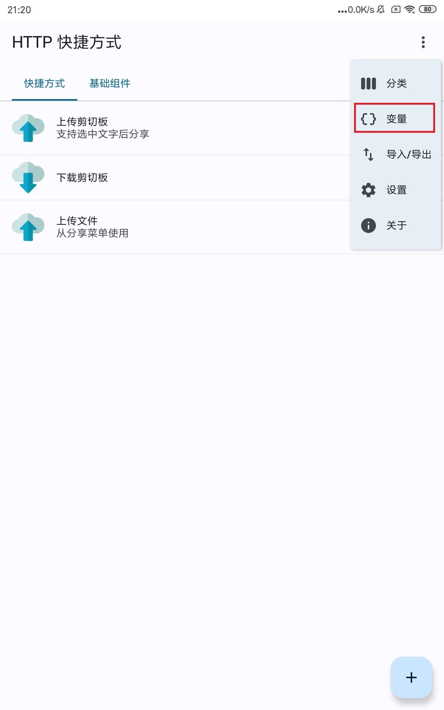
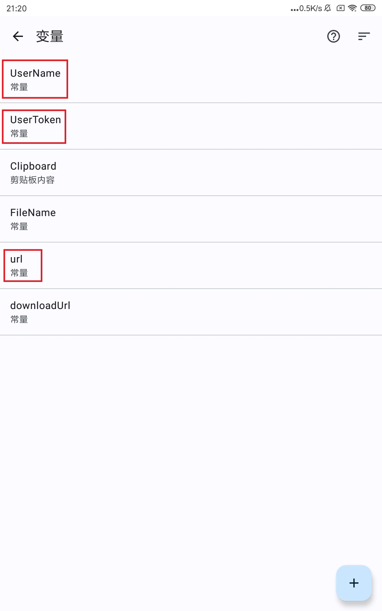
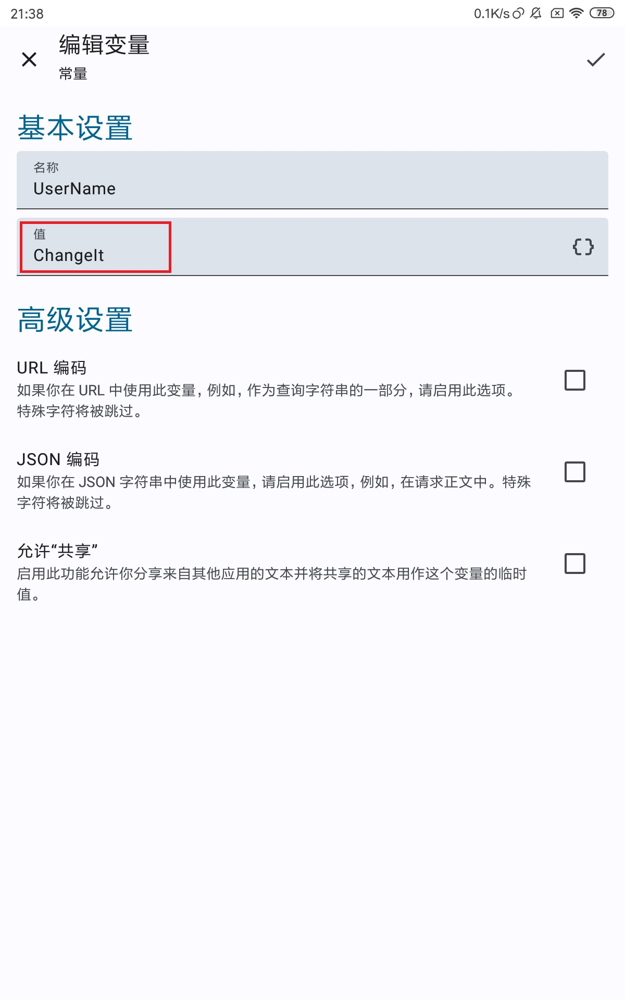

# SyncClipboard
[](https://github.com/Jeric-X/SyncClipboard/actions?query=branch%3Amaster)

中文 | [English](docs/README_EN.md)  

<details>
<summary>目录</summary>

- [SyncClipboard](#syncclipboard)
  - [功能](#功能)
  - [服务器](#服务器)
    - [独立服务器](#独立服务器)
      - [使用Docker容器部署服务器](#使用docker容器部署服务器)
        - [Docker](#docker)
        - [Docker Compose](#docker-compose)
    - [客户端内置服务器](#客户端内置服务器)
    - [WebDAV服务器](#webdav服务器)
  - [客户端](#客户端)
    - [Windows](#windows)
    - [Linux, macOS](#linux-macos)
    - [IOS](#ios)
      - [使用快捷指令](#使用快捷指令)
    - [Android](#android)
      - [使用HTTP Request Shortcuts](#使用http-request-shortcuts)
      - [使用Autox.js](#使用autoxjs)
      - [使用Tasker](#使用tasker)
    - [客户端配置说明](#客户端配置说明)
  - [API](#api)
    - [获取/上传剪贴板（文字）](#获取上传剪贴板文字)
    - [获取/上传剪贴板（图片/文件）](#获取上传剪贴板图片文件)
    - [SyncClipboard.json](#syncclipboardjson)
  - [项目依赖](#项目依赖)

</details>

## 功能

- 剪贴板同步，支持文字、图片和文件。服务器/客户端架构，可以使用客户端内置服务器、独立部署服务器，也可以使用支持WebDAV的网盘作为服务器  
- 优化图片类型的剪贴板，功能有：
  - 从任意位置复制图片时，可以直接向文件系统粘贴图片文件，反之亦然
  - 从浏览器复制图片后，后台下载原图到本地，解决无法从浏览器拷贝动态图的问题（大多网站有认证，适用范围有限，支持bilibili动态图片）
  - 从文件系统复制较新格式类型的图片文件时（webp/heic等），在剪贴板内储存gif或jpg格式，用于直接向支持图片的文本框粘贴图片

## 服务器
### 独立服务器
[SyncClipboard.Server](https://github.com/Jeric-X/SyncClipboard/releases/)支持跨平台运行，依赖[ASP.NET Core 6.0](https://dotnet.microsoft.com/zh-cn/download/dotnet/6.0)，安装`ASP.NET Core 运行时`后，通过以下命令运行
```
dotnet /path/to/SyncClipboard.Server.dll --contentRoot ./
```
工作目录与dll所在目录一致，会产生临时文件，在`appsettings.json`中可以修改绑定的ip和端口，以及客户端认证需要的用户名和密码  
如需修改工作目录，拷贝一份appsettings.json到新工作目录并修改`--contentRoot`后的路径  

注意：
- 默认用户名是`admin`，密码是`admin`，端口号是`5033`
- 客户端处填写`http://ip:端口号`，`http`不可省略
- http使用明文传输(包括本软件用于认证使用的基于Basic Auth的账号密码)，在公网部署考虑使用反向代理工具配置SSL
- 内置服务器并不是WebDAV实现

#### 使用Docker容器部署服务器

在宿主机中拷贝一份服务器配置文件[appsettings.json](https://github.com/Jeric-X/SyncClipboard/raw/master/src/SyncClipboard.Server/appsettings.json)

```
mkdir syncclipboard-server && cd syncclipboard-server
curl -sL https://github.com/Jeric-X/SyncClipboard/raw/master/src/SyncClipboard.Server/appsettings.json > appsettings.json
```

根据你的需求在配置文件中修改用户名、密码

##### Docker

执行下边的命令，注意将命令行中的`/path/to/appsettings.json`修改为宿主机中`appsettings.json`的实际路径

```
docker run -d \
  --name=syncclipboard-server \
  -p 5033:5033 \
  -v /path/to/appsettings.json:/app/appsettings.json \
  --restart unless-stopped \
  jericx/syncclipboard-server:latest
```

##### Docker Compose

在宿主机中拷贝一份[docker-compose.yml](https://github.com/Jeric-X/SyncClipboard/raw/master/src/SyncClipboard.Server/docker-compose.yml)

```
curl -sL https://github.com/Jeric-X/SyncClipboard/raw/master/src/SyncClipboard.Server/docker-compose.yml > docker-compose.yml
```

将`docker-compose.yml`文件中的`/path/to/appsettings.json`修改为宿主机中`appsettings.json`的实际路径，然后执行

```
docker compose up -d
```

注意：
- 服务器和容器相关文件储存在`src/SyncClipboard.Server`目录中，命令行无法下载时可以手动下载
- Docker镜像的托管地址是[Docker Hub/jericx/syncclipboard-server](https://hub.docker.com/r/jericx/syncclipboard-server)

### 客户端内置服务器

桌面客户端（Windows/Linux/macOS）内置了服务器，可以使用可视界面配置，注意事项同上

### WebDAV服务器
可以使用支持WebDAV协议的网盘作为服务器  
测试过的服务器：   

- [x] [Nextcloud](https://nextcloud.com/) 
- [x] [坚果云](https://www.jianguoyun.com/)
- [x] [AList](https://alist.nn.ci/)
- [x] [InfiniCLOUD](https://infini-cloud.net/en/)

注意：
- 坚果云有每月流量限制和短时间内请求次数限制，建议自行设置桌面端的`轮询服务器间隔`和`最大上传文件大小`   

## 客户端

桌面客户端（Windows/Linux/macOS）运行在后台时将自动同步剪贴板
<details>
<summary>展开/折叠截图</summary>


</details>

### Windows
下载地址：[Release](https://github.com/Jeric-X/SyncClipboard/releases/)页面中的`SyncClipboard.zip`，解压缩后运行`SyncClipboard.exe`  

依赖：   
- [.NET 6.0桌面运行时](https://dotnet.microsoft.com/en-us/download/dotnet/thank-you/runtime-desktop-6.0.16-windows-x64-installer)，未安装会弹窗提醒并跳转到微软官方下载页面  
- [ASP.NET Core 6.0运行时](https://dotnet.microsoft.com/en-us/download/dotnet/thank-you/runtime-aspnetcore-6.0.16-windows-x64-installer)，未安装会弹窗提醒并跳转到微软官方下载页面  
- Windows10 2004及以上
- 微软[Segoe Fluent Icons](https://learn.microsoft.com/zh-cn/windows/apps/design/style/segoe-fluent-icons-font)图标字体，Windows11自带无需安装，Windows10需要手动下载安装（[官方地址](https://aka.ms/SegoeFluentIcons)），否则界面图标会大范围出错

注意：
- 删除软件时，配置文件目录不会被删除，配置文件储存在`%AppData%\SyncClipboard\`，需要彻底删除软件时请手动删除整个目录

### Linux, macOS
下载地址：[SyncClipboard.Desktop](https://github.com/Jeric-X/SyncClipboard.Desktop/releases)，根据系统选择你需要的安装包  

注意：
- 名称中带有`no-self-contained`：依赖[.NET 6.0桌面运行时](https://dotnet.microsoft.com/en-us/download/dotnet/6.0)和[ASP.NET Core 6.0运行时](https://dotnet.microsoft.com/en-us/download/dotnet/6.0)
- 名称中带有`self-contained`：通常可以直接运行
- 删除软件时，配置文件目录不会被删除，配置文件储存在`~/.config/SyncClipboard/`(Linux)，`~/Library/Application Support/SyncClipboard/`(macOS)，需要彻底删除软件时请手动删除整个目录
- 使用`deb`、`rpm`安装包时，每次更新版本需要先删除旧版，再安装新版，不支持直接更新
- Linux: 快捷键在Wayland不可用
- Linux: 无法自动识别语言，默认为英语
- macOS: `“SyncClipboard”已损坏，无法打开`，在终端中执行`sudo xattr -d com.apple.quarantine /Applications/SyncClipboard.app`
- macOS: 快捷键依赖辅助功能权限(Accessibility)，软件在需要时会弹窗提示（所有快捷键为空时则不需要），每个新版本需要重新授予权限

### IOS 
#### 使用[快捷指令](https://apps.apple.com/cn/app/%E5%BF%AB%E6%8D%B7%E6%8C%87%E4%BB%A4/id1462947752)  

- 手动同步，导入这个[快捷指令](https://www.icloud.com/shortcuts/ecd4200276ba4cc2b0839462215eb1d8)，手动触发上传或下载
- 自动同步，导入这个[快捷指令](https://www.icloud.com/shortcuts/542ad23b33314b36807c05a5d8aa5c22)，运行后设备会自动在后台同步剪贴板内容，此快捷指令将执行无限时长，需要手动关闭，你还可以手动修改同步后是否发送系统通知、查询的间隔秒数
- 自动上传短信验证码，参考这个帖子中的视频教程 https://github.com/Jeric-X/SyncClipboard/discussions/60

### Android
#### 使用[HTTP Request Shortcuts](https://github.com/Waboodoo/HTTP-Shortcuts)
导入这个[配置文件](/script/shortcuts.zip)，修改`变量`中的`UserName`，`UserToken`，`url`， `url`不要以斜线分隔符`/`结尾。`HTTP Request Shortcuts`支持从下拉菜单、桌面组件、桌面图标、分享菜单中使用

<details>
<summary>导入配置文件后修改配置图示</summary>





</details>

#### 使用[Autox.js](https://github.com/kkevsekk1/AutoX)

- 自动同步，使用这个[js文件](/script/SyncAutoxJs.js)。由于安卓系统限制，在安卓10及以上的系统应用无法在后台读取剪贴板，但可以使用基于Root权限的工具(Magisk/Xposed)解除应用后台读取剪贴版的权限，如[Riru-ClipboardWhitelist](https://github.com/Kr328/Riru-ClipboardWhitelist)、[Clipboard Whitelist](https://modules.lsposed.org/module/io.github.tehcneko.clipboardwhitelist)。由于在安卓13及以上的系统应用必须由用户手动授权才被允许访问系统日志（剪贴板），也可以使用Xposed自动为应用授权访问系统日志的权限，如[DisableLogRequest/禁用日志访问请求](https://github.com/QueallyTech/DisableLogRequest)
- 自动上传验证码，使用这个[js文件](/script/UploadVerificationCode.js)，这个脚本运行在后台时将读取所有通知消息，在识别到验证码类信息时将证码上传到服务器

导入js文件、修改每个文件头部的用户配置后，手动点击运行，或者为每个js文件设置触发方式，例如：开机时触发

#### 使用[Tasker](https://tasker.joaoapps.com/)

- https://github.com/forrestgao/taskerforSyncClipboard ，作者：[forrestgao](https://github.com/forrestgao)

Tasker是一款安卓系统上非常强大的自动化工具软件，你可以根据SyncClipboard的API创建适合自己的配置文件，如果你认为你的配置文件非常通用并希望分享出来，欢迎联系我置于此处


### 客户端配置说明

全平台依赖三条必要配置（配置的拼写可能会有所不同，含义相同）。
- user
- password
- url，格式为http(s)://ip(或者域名):port。使用WebDav服务器时，url需要具体到一个已存在的文件夹作为工作目录，例如`https://domain.com/dav/folder1/working%20folder`，特殊符号需要使用url转义字符代替，不要使用这个文件夹存储其他文件。不使用桌面客户端（Windows/Linux/macOS）时需在工作目录中再创建`file`文件夹以同步文件，桌面客户端会在设置服务器时自动创建`file`文件夹。url尽量不要以斜线分隔符`/`结尾，在部分客户端中会出现问题。

## API

API基于WebDAV，在独立服务器运行环境下设定环境变量ASPNETCORE_ENVIRONMENT为Development后运行服务器，或桌面客户端打开服务器并打开设置里的诊断模式后，
访问`http://ip:端口/swagger/index.html`可以打开API页面，以下是部分关键API

### 获取/上传剪贴板（文字）
```
GET /SyncClipboard.json
PUT /SyncClipboard.json
```

### 获取/上传剪贴板（图片/文件）
```
GET  /SyncClipboard.json
HEAD /file/filename         // optional
GET  /file/filename

PUT /file/filename
PUT /SyncClipboard.json
```

### SyncClipboard.json
```
{
    "Type" : "Text"
    "Clipboard" : "Content",
    "File":""
}

{
    "Type": "Image", // or "File", "Group"
    "Clipboard": "hash, optional",
    "File": "filename"
}
```

## 项目依赖
[Magick.NET](https://github.com/dlemstra/Magick.NET)  
[.NET Community Toolkit](https://github.com/CommunityToolkit/dotnet)  
[H.NotifyIcon](https://github.com/HavenDV/H.NotifyIcon)  
[WinUIEx](https://github.com/dotMorten/WinUIEx)  
[moq](https://github.com/moq/moq)  
[Avalonia](https://avaloniaui.net/)  
[FluentAvalonia.BreadcrumbBar](https://github.com/indigo-san/FluentAvalonia.BreadcrumbBar)  
[FluentAvalonia](https://github.com/amwx/FluentAvalonia)  
[Vanara](https://github.com/dahall/Vanara)  
[Tmds.DBus](https://github.com/tmds/Tmds.DBus)  
[SharpHook](https://github.com/TolikPylypchuk/SharpHook)  
[DotNetZip.Semverd](https://github.com/haf/DotNetZip.Semverd)  
