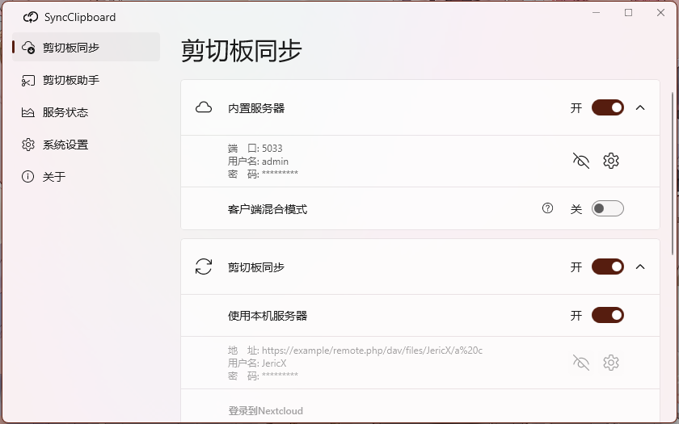
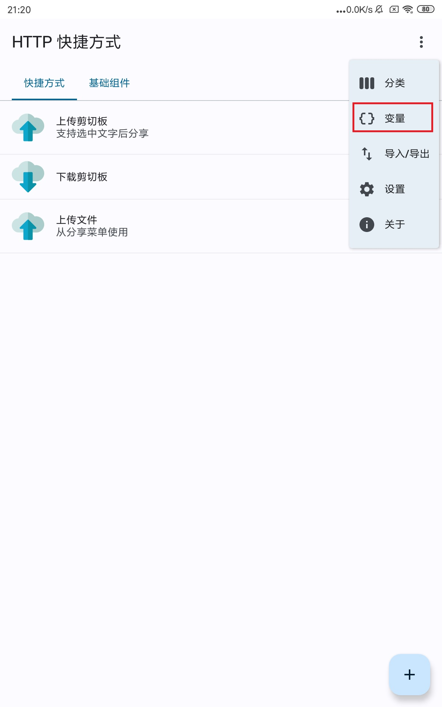
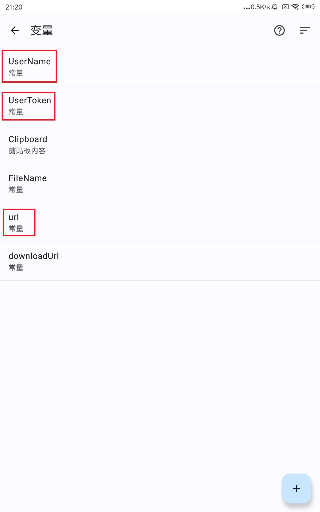
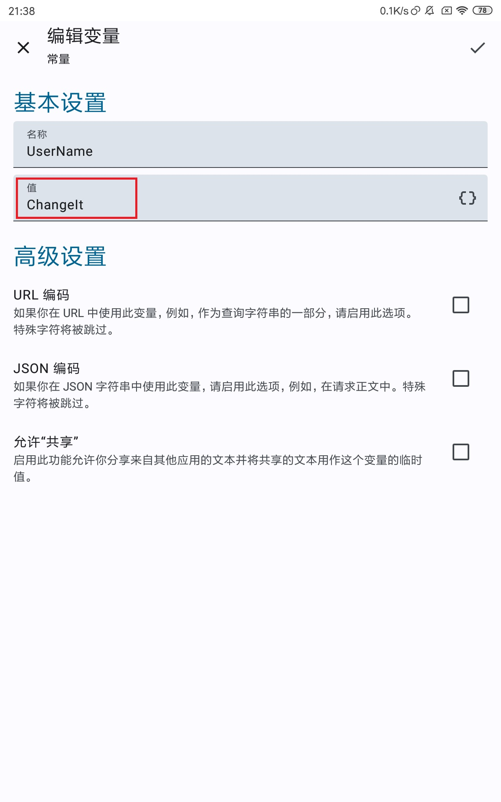
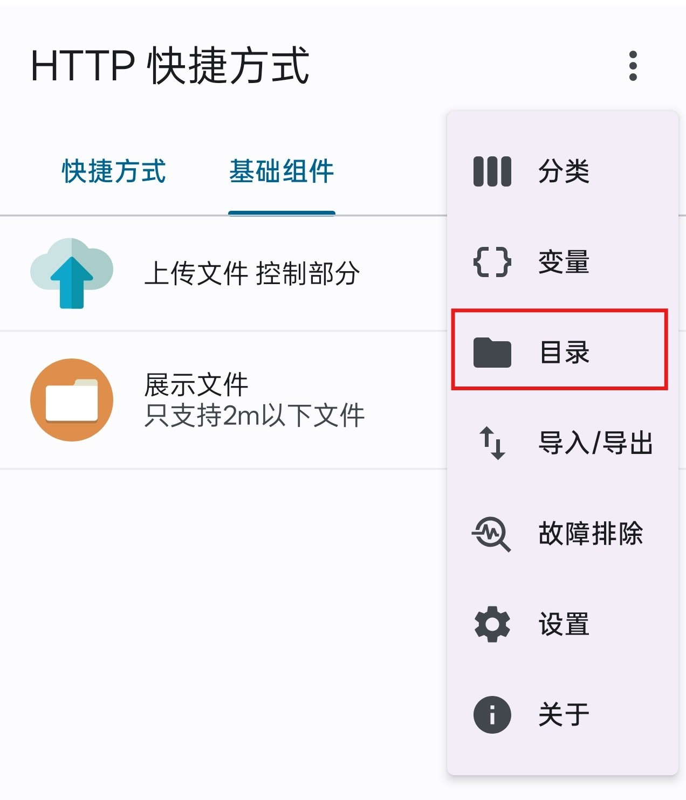
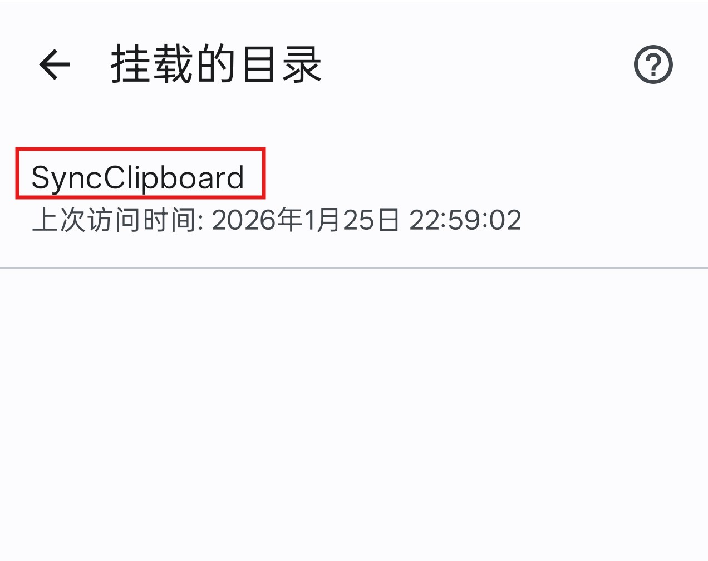
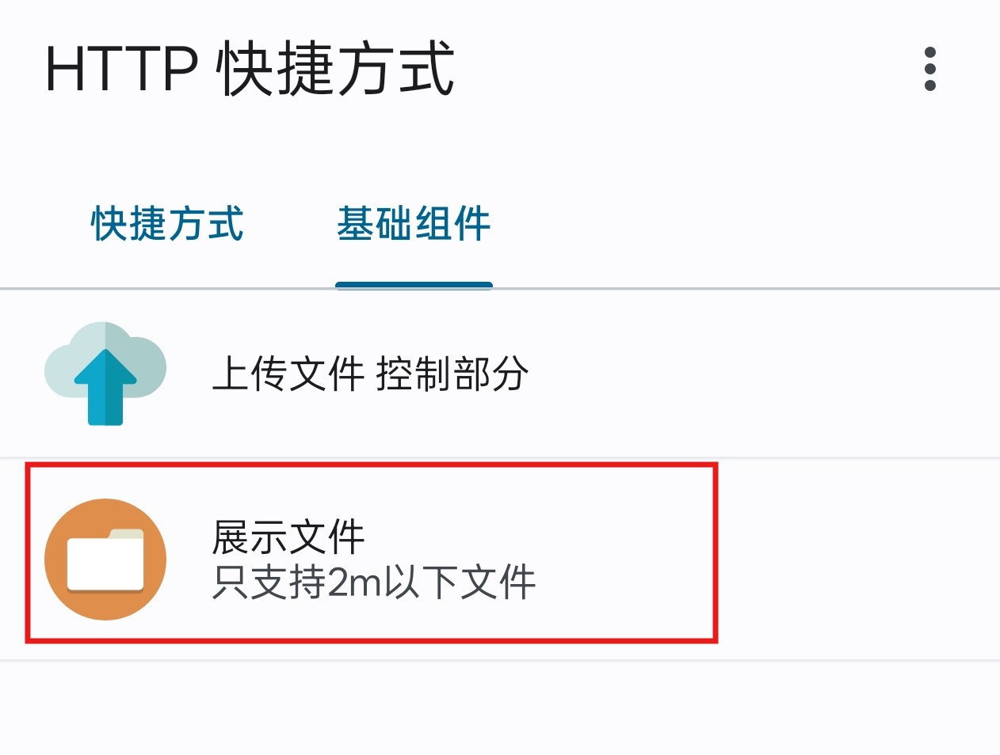
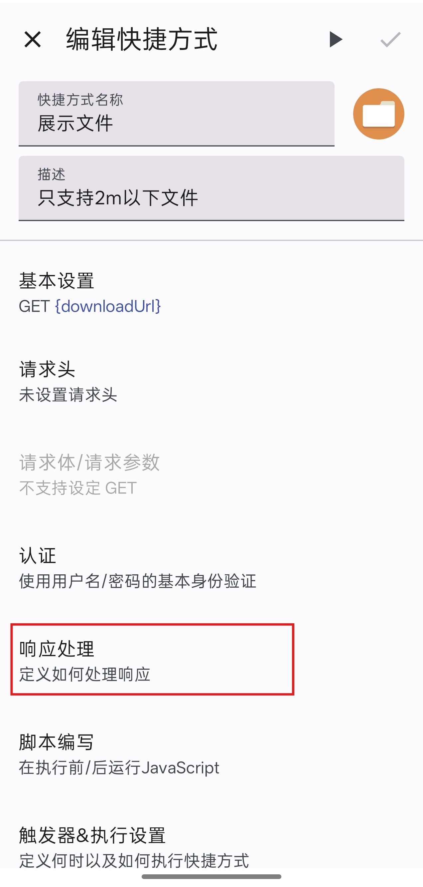
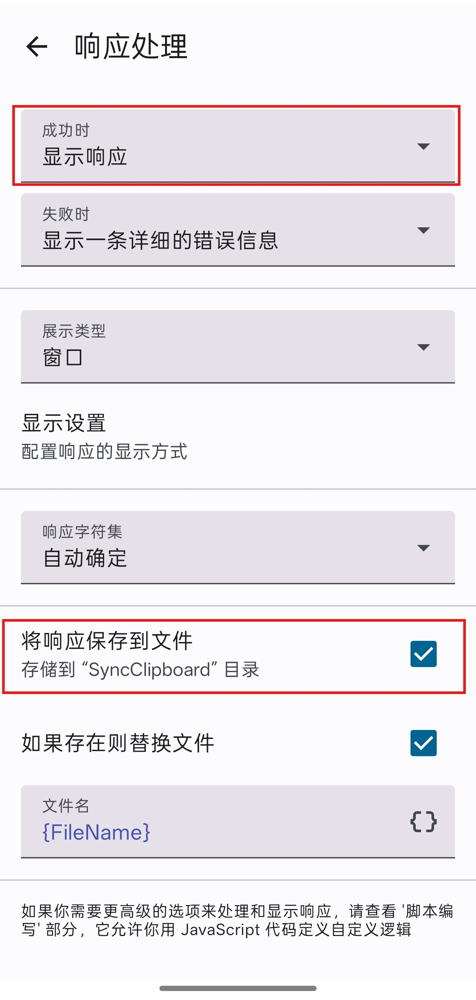

# SyncClipboard
[](https://github.com/Jeric-X/SyncClipboard/actions?query=branch%3Amaster)

中文 | [English](docs/README_EN.md)  

<details>
<summary>目录</summary>

- [SyncClipboard](#syncclipboard)
  - [功能](#功能)
  - [不兼容变更记录](#不兼容变更记录)
    - [v3.1.1](#v311)
  - [服务器](#服务器)
    - [独立服务器](#独立服务器)
      - [服务器配置](#服务器配置)
      - [Docker](#docker)
      - [Arch Linux](#arch-linux)
    - [客户端内置服务器](#客户端内置服务器)
    - [WebDAV服务器](#webdav服务器)
    - [S3服务器](#s3服务器)
  - [客户端](#客户端)
    - [Windows](#windows)
      - [免安装板](#免安装板)
      - [故障排除](#故障排除)
    - [macOS](#macos)
      - [手动安装](#手动安装)
      - [故障排除](#故障排除-1)
    - [Linux](#linux)
      - [手动安装](#手动安装-1)
      - [Arch Linux](#arch-linux-1)
      - [故障排除](#故障排除-2)
    - [桌面客户端命令行参数](#桌面客户端命令行参数)
      - [--shutdown-previous](#--shutdown-previous)
      - [--command-{command-name}](#--command-command-name)
    - [IOS](#ios)
      - [使用快捷指令](#使用快捷指令)
    - [Android](#android)
      - [使用SyncClipboard Mobile](#使用syncclipboard-mobile)
      - [使用Sync Clipboard Flutter](#使用sync-clipboard-flutter)
      - [使用HTTP Request Shortcuts](#使用http-request-shortcuts)
      - [使用AutoJs6脚本](#使用autojs6脚本)
      - [使用SmsForwarder](#使用smsforwarder)
      - [使用Tasker](#使用tasker)
      - [使用Fcitx5-SyncClipboard](#使用fcitx5-syncclipboard)
    - [鸿蒙OS (HarmonyOS Next)](#鸿蒙os-harmonyos-next)
      - [使用ClipLink](#使用cliplink)
    - [客户端配置说明](#客户端配置说明)
  - [API](#api)
    - [获取剪贴板](#获取剪贴板)
    - [上传剪贴板](#上传剪贴板)
    - [SyncClipboard.json](#syncclipboardjson)
    - [S3 同步协议规范](#s3-同步协议规范)
  - [项目依赖](#项目依赖)

</details>

## 功能

- 跨平台（Windows/macOS/Linux）剪贴板实时同步、剪贴板历史记录管理、历史记录同步
- 支持客户端内置服务器、docker部署服务器，也可以使用支持WebDAV协议或S3兼容API的对象存储作为服务器
- 基于第三方工具的移动端剪贴板同步
- 优化图片类型的剪贴板，功能有：
  - 从任意位置复制图片时，可以直接向文件系统粘贴图片文件，反之亦然
  - 从浏览器复制图片后，后台下载原图到本地，解决无法从浏览器直接复制动态图的问题
  - 从文件系统复制较新格式类型的图片文件时（webp/heic等），在剪贴板内储存gif或jpg格式，用于直接向支持图片的文本框粘贴图片

> [!WARNING]  
> 剪贴板历史记录功能处于早期阶段，请做好丢失全部信息的准备，重要信息不要仅依赖本工具保存
>

## 不兼容变更记录
### [v3.1.1](https://github.com/Jeric-X/SyncClipboard/issues/286)
v3.1.1及以上的客户端、服务器与之前的版本不兼容，同步网络中的客户端、服务器、第三方客户端需同步升级


## 服务器
### 独立服务器
[SyncClipboard.Server](https://github.com/Jeric-X/SyncClipboard/releases/)支持跨平台运行，依赖[ASP.NET Core 8.0](https://dotnet.microsoft.com/zh-cn/download/dotnet/8.0)，安装`ASP.NET Core 运行时`后，通过以下命令运行
```
dotnet /path/to/SyncClipboard.Server.dll --contentRoot ./
```
工作目录与dll所在目录一致，需要写入权限。如需修改工作目录，拷贝一份`appsettings.json`到新工作目录并修改`--contentRoot`后的路径  

#### 服务器配置
服务器通过`appsettings.json`文件配置，形式如下：
```jsonc
{
  "Logging": {
    "LogLevel": {
      "Default": "Information",
      "Microsoft.AspNetCore": "Warning"
    }
  },
  "AllowedHosts": "*",
  "Kestrel": {
    "Endpoints": {
      "http": {
        "Url": "http://*:5033"
      },
      //"https": {
      //  "Url": "https://*:5033"
      //}
    },
    //"Certificates": {
    //  "Default": {
    //    "Path": "/path/to/pem",
    //    "KeyPath": "/path/to/pem_key"
    //  }
    //}
  },
  "AppSettings": {
    "UserName": "your_username",
    "Password": "your_password",
    "MaxSavedHistoryCount": 1000
  }
}
```
如需启用HTTPS，请取消`https`和`Certificates`部分的注释，并设定HTTPS证书路径。最后将`http`部分注释或删除以关闭不安全的连接。如需同时启用HTTP和HTTPS，请将二者`Url`设置为不同的端口号  
不同类型证书的配置方法可以参考[微软官方文档](https://learn.microsoft.com/en-us/aspnet/core/fundamentals/servers/kestrel/endpoints?view=aspnetcore-8.0#configure-https-in-appsettingsjson)

用户名和密码支持使用环境变量配置，当环境变量`SYNCCLIPBOARD_USERNAME`、`SYNCCLIPBOARD_PASSWORD`均不为空时，将优先使用这两个环境变量作为用户名和密码  

环境变量`ASPNETCORE_hostBuilder__reloadConfigOnChange`用于配置是否自动识别appsettings.json变动并重载配置，默认值为`false`，修改为任何非`false`值后会启用此功能

> [!WARNING]  
> HTTP使用明文传输，在公共网络部署服务器请启用HTTPS或使用反向代理工具配置HTTPS。无法从证书颁发机构获取证书时，推荐使用开源工具[mkcert](https://github.com/FiloSottile/mkcert)或其他方式生成自签名证书

#### Docker

```shell
# docker
docker run -d \
  --name=syncclipboard-server \
  -p 5033:5033 \
  -e SYNCCLIPBOARD_USERNAME=your_username \
  -e SYNCCLIPBOARD_PASSWORD=your_password \
  -v /data/syncclipboard-server:/app/data \
  --restart unless-stopped \
  jericx/syncclipboard-server:latest

# docker compose
curl -sL https://github.com/Jeric-X/SyncClipboard/raw/master/src/SyncClipboard.Server/docker-compose.yml >> docker-compose.yml
docker compose up -d
```

首次启动容器后，在容器目录`/app/data`（即主机`/data/syncclipboard-server`目录）下会自动创建默认的`appsettings.json`  
修改`appsettings.json`时，涉及文件路径的，请注意容器与主机间的文件映射关系

#### Arch Linux

可以直接从 [AUR](https://aur.archlinux.org/packages/syncclipboard-server) 安装（由 [@devome](https://github.com/devome) 维护）：

```shell
paru -Sy syncclipboard-server
```

配置文件路径为`/etc/syncclipboard/appsettings.json`，修改配置后使用`systemctl`命令启动即可：

```shell
sudo systemctl enable --now syncclipboard.service
```

### 客户端内置服务器

桌面客户端（Windows/Linux/macOS）内置了服务器功能，可以使用可视界面配置

### WebDAV服务器
可以使用支持WebDAV协议的网盘作为服务器  
测试过的服务器：   

- [x] [Nextcloud](https://nextcloud.com/) 
- [x] [AList](https://alist.nn.ci/)
- [x] [InfiniCLOUD](https://infini-cloud.net/en/)
- [x] [aliyundrive-webdav](https://github.com/messense/aliyundrive-webdav)

### S3服务器
桌面客户端支持使用 AWS 官方 S3 SDK 直连 S3，也支持使用兼容 S3 API 的对象存储服务。  
添加账号时选择`S3`，配置以下字段：

- `Server Address`：可选，AWS 可留空；使用兼容 S3 的服务时填写对应 endpoint
- `Region`：签名区域，例如`us-east-1`
- `Bucket Name`：用于存储`SyncClipboard.json`与`file/`对象的 bucket
- `Object Prefix`：可选，建议设置独立前缀（如`syncclipboard`）隔离数据
- `Force Path-Style Addressing`：兼容服务建议开启
- `Access Key ID` / `Secret Access Key`：访问密钥

## 客户端

桌面客户端（Windows/Linux/macOS）运行在后台时将自动同步剪贴板
<details>
<summary>展开/折叠截图</summary>



</details>

### Windows
#### 免安装板

在[Release](https://github.com/Jeric-X/SyncClipboard/releases/latest)页面下载名字以`SyncClipboard_win_`开头的zip文件，解压后运行`SyncClipboard.exe`

#### 故障排除
- 支持的最低系统版本为Windows10 2004
- 在Windows 10中运行SyncClipboard时界面图标大范围出错，请下载安装微软[Segoe Fluent Icons](https://aka.ms/SegoeFluentIcons)图标字体

### macOS
#### 手动安装
在[Release](https://github.com/Jeric-X/SyncClipboard/releases/latest)页面下载名字以`SyncClipboard_macos_`开头的安装包，双击后拖动SyncClipboard图标到Applications文件夹

#### 故障排除
- 系统提示`由于开发者无法验证，“SyncClipboard”无法打开`： 
在macOS的`设置`->`隐私与安全性`页面，点击`仍要打开`
- 系统提示`“SyncClipboard”已损坏，无法打开`：在终端中执行`sudo xattr -d com.apple.quarantine /Applications/SyncClipboard.app`
- 部分功能需要模拟键盘输入实现复制或粘贴，依赖辅助功能权限，软件在需要时会弹窗提示授权

### Linux
#### 手动安装
在[Release](https://github.com/Jeric-X/SyncClipboard/releases/latest)页面下载名字以`SyncClipboard_linux_`开头的安装包

#### Arch Linux

Arch Linux 用户可以直接从[AUR](https://aur.archlinux.org/packages/syncclipboard-desktop)安装（由 [@devome](https://github.com/devome) 维护）：

```shell
paru -Sy syncclipboard-desktop
```

安装后从菜单中启动即可。如果在命令行中使用命令`syncclipboard-desktop`启动报错，请将环境变量`LANG`设置为`en_US.UTF-8`，以`LANG=en_US.UTF-8 syncclipboard-desktop`来启动。

#### 故障排除
- 剪贴板同步不及时、无法同步、上传乱码：建议在系统内安装`xclip`（X11）或`wl-clipboard`（Wayland），SyncClipboard会使用这些工具辅助获取剪贴板以增强稳定性。使用`xclip -version`或`wl-paste -version`命令确认是否已安装
- 使用`deb`、`rpm`安装包时，升级安装失败时，请先删除旧版再安装新版
- 使用`AppImage`包时，请确认AppImage文件具有可执行权限
- 快捷键在Wayland可能无法使用

> [!NOTE]  
> 需要彻底删除SyncClipboard时请手动删除配置文件和临时文件目录：  
> `%AppData%\SyncClipboard\`(Windows)，`~/Library/Application Support/SyncClipboard/`(macOS)，`~/.config/SyncClipboard/`(Linux)

### 桌面客户端命令行参数

#### --shutdown-previous
关闭已经运行的SyncClipboard，运行新的实例

#### --command-{command-name}
运行指定命令，`{command-name}`为命令名称，设置快捷键后，在配置文件中可以查看对应的命令名称，即使清除快捷键配置，命令行参数仍然有效  
当存在已经运行的SyncClipboard时，不会启动新的实例，而是调用已经运行的SyncClipboard执行命令。当不存在已经运行的SyncClipboard时，将在启动完成后立刻执行命令  
支持多个`--command-{command-name}`参数，多个命令同时执行  

> [!NOTE]  
> macOS使用命令行参数时，请使用可执行程序的完整路径`/Applications/SyncClipboard.app/Contents/MacOS/SyncClipboard.Desktop.MacOS`

### IOS 
#### 使用[快捷指令](https://apps.apple.com/cn/app/%E5%BF%AB%E6%8D%B7%E6%8C%87%E4%BB%A4/id1462947752)  

- 手动同步，导入这个[快捷指令](https://www.icloud.com/shortcuts/34404963b512432cb5672c8a95001b19)，手动触发上传或下载
- 自动同步，导入这个[快捷指令](https://www.icloud.com/shortcuts/05e7ac5aca5f4f588b776117cf740587)，运行后设备会自动在后台同步剪贴板内容，此快捷指令将执行无限时长，需要手动关闭，你还可以手动修改同步后是否发送系统通知、查询的间隔秒数
- 自动上传短信验证码，参考这个帖子中的视频教程 https://github.com/Jeric-X/SyncClipboard/discussions/60

### Android
#### 使用[SyncClipboard Mobile](https://github.com/Jeric-X/syncclipboard-mobile)

- 从通知中心、桌面快捷方式、分享菜单中快捷手动触发
- 一定程度的后台同步能力
- 剪贴板历史记录及同步
- 自动上传短信验证码

#### 使用[Sync Clipboard Flutter](https://github.com/bling-yshs/sync-clipboard-flutter)

这是一个使用 Flutter 构建的 Material 3 风格的、适配了SyncClipboard API的安卓客户端应用，支持从控制中心快捷上传或下载。

功能详情、使用步骤、系统要求等信息请查看该项目的 [README](https://github.com/bling-yshs/sync-clipboard-flutter)

#### 使用[HTTP Request Shortcuts](https://github.com/Waboodoo/HTTP-Shortcuts)
导入这个[配置文件](https://github.com/Jeric-X/SyncClipboard/raw/refs/heads/dev/script/shortcuts.zip)，修改`变量`中的`UserName`，`UserToken`，`url`， `url`不要以斜线分隔符`/`结尾。`HTTP Request Shortcuts`支持从下拉菜单、桌面组件、桌面图标、分享菜单中使用

<details>
<summary>导入配置文件后修改配置图示</summary>

- 通过`变量`修改账号、密码、网址
  



  
  
- 下载文件时，如果你希望自动将文件存储到文件系统，请根据下图修改储存位置  
  


  
  
- 下载文件时，如果你想修改默认行为（默认行为：弹出一个展示页面等待用户处理，并将文件保存到前面选择的位置），可以根据你的需求修改如下内容  
  



  

</details>

#### 使用[AutoJs6脚本](https://github.com/imgs/SyncAutojs6)

此项目通过[AutoJs6](https://github.com/SuperMonster003/AutoJs6)基于悬浮窗的后台剪贴板获取方式，实现了Android 10+系统上的后台剪贴板同步能力

#### 使用[SmsForwarder](https://github.com/pppscn/SmsForwarder)

- 自动上传验证码， https://github.com/Jeric-X/SyncClipboard/discussions/109

#### 使用[Tasker](https://tasker.joaoapps.com/)

- https://github.com/forrestgao/taskerforSyncClipboard ，作者：[forrestgao](https://github.com/forrestgao)

Tasker是一款安卓系统上非常强大的自动化工具软件，你可以根据SyncClipboard的API创建适合自己的配置文件，如果你认为你的配置文件非常通用并希望分享出来，欢迎联系我置于此处

#### 使用[Fcitx5-SyncClipboard](https://github.com/qh7574/Fcitx5-SyncClipboard)

这是一个为 Fcitx5-android 开发的插件，借助输入法特权实现与 SyncClipboard 服务的无感剪贴板同步，无需手动获取；同时支持同步大文本、图片、文件等，文件无感下载并智能复制 uri 到剪贴板。

具体使用方法、操作事项等请参见该项目 [README.md](https://github.com/qh7574/Fcitx5-SyncClipboard)


### 鸿蒙OS (HarmonyOS Next)
#### 使用[ClipLink](https://github.com/xiebaiyuan/ClipLink)

适配 HarmonyOS Next 的客户端。从 [Releases](https://github.com/xiebaiyuan/ClipLink/releases) 页面下载 `.hap` 文件，通过 [auto-installer](https://github.com/likuai2010/auto-installer) 或 `hdc install` 命令进行 sideload 安装（受鸿蒙系统限制，暂不支持直接安装）。


### 客户端配置说明

全平台依赖三条必要配置（配置的拼写可能会有所不同，含义相同）。
- user
- password
- url，格式为http(s)://ip(或者域名):port。使用WebDav服务器时，url需要具体到一个已存在的文件夹作为工作目录，例如`https://domain.com/dav/folder1/working%20folder`，特殊符号需要使用url转义字符代替，不要使用这个文件夹存储其他文件。不使用桌面客户端（Windows/Linux/macOS）时需在工作目录中再创建`file`文件夹以同步文件，桌面客户端会在设置服务器时自动创建`file`文件夹。url尽量不要以斜线分隔符`/`结尾，在部分客户端中会出现问题。

## API

在独立服务器运行环境下设定环境变量ASPNETCORE_ENVIRONMENT为Development后运行服务器，或桌面客户端打开服务器并打开设置里的诊断模式后，
访问`http://ip:端口/swagger/index.html`可以打开API描述页面

API路径不以`/api/`起始的为WebDAV兼容API，实现客户端时，调用此类API可以同时支持基于WebDAV服务器与SyncClipboard官方服务器的剪贴板同步功能，其中的关键API的说明如下

### 获取剪贴板
```shell
GET /SyncClipboard.json
GET /file/dataName            # optional
```

### 上传剪贴板
```shell
PUT /file/dataName            # optional
PUT /SyncClipboard.json
```

### SyncClipboard.json
```jsonc
{
  "type": "Text",             // or Image/File/Group, required
  "hash": "string",           // optional, empty string is treated as null
  "text": "string",           // required
  "hasData": true,            // or false, required  
  "dataName": "string",       // if hasData is true, required
  "size": 0                   // optional
}
```

- API所有字段大小写敏感
- `text`储存剪贴板预览字符串，或完整的Text类型剪贴板内容
- `hasData`标识是否使用一个额外文件存储完整的剪贴板信息
  - 对于Image/File/Group类型，`hasData`恒为true
  - 对于Text类型，可以根据原字符串的长度，可选是否使用额外的UTF8编码的`.txt`文件存储完整字符串，如果这样做，`text`字段仅储存完整字符串的起始部分内容
- `hash`值为剪贴板内容的唯一标识，计算方法请参考[docs/Hash.md](docs/Hash.md)
  - 发送方应尽量提供`hash`信息
  - 当`hash`值存在时，接收方应验证`hash`信息与剪贴板内容的一致性，在不一致时执行错误处理流程
  - 当`hash`为空时，或处于无法计算`hash`的环境，可以使用`type`/`text`的组合简单判断剪贴板内容的相等性
- `size`标识复制文件的总字节大小，或Text类型剪贴板完整字符串的长度，仅用于展示

### S3 同步协议规范

使用 S3 兼容对象存储作为同步后端时的协议与数据格式规范请参阅 [S3 Adapter Design](docs/S3-Adapter-Design.md)。

## 项目依赖
[NativeNotification](https://github.com/Jeric-X/NativeNotification)  
[Magick.NET](https://github.com/dlemstra/Magick.NET)  
[.NET Community Toolkit](https://github.com/CommunityToolkit/dotnet)  
[H.NotifyIcon](https://github.com/HavenDV/H.NotifyIcon)  
[WinUIEx](https://github.com/dotMorten/WinUIEx)  
[moq](https://github.com/moq/moq)  
[Avalonia](https://avaloniaui.net/)  
[FluentAvalonia.BreadcrumbBar](https://github.com/indigo-san/FluentAvalonia.BreadcrumbBar)  
[FluentAvalonia](https://github.com/amwx/FluentAvalonia)  
[AsyncImageLoader.Avalonia](https://github.com/AvaloniaUtils/AsyncImageLoader.Avalonia)  
[Vanara](https://github.com/dahall/Vanara)  
[Tmds.DBus](https://github.com/tmds/Tmds.DBus)  
[SharpHook](https://github.com/TolikPylypchuk/SharpHook)  
[Quartz.NET](https://github.com/quartznet/quartznet)  
[MiSans](https://hyperos.mi.com/font)  
