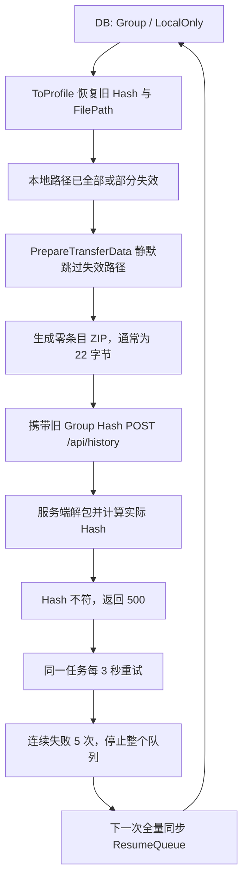

# Issue #408：Group 本地数据缺失后的空 ZIP 与无限重试

## 文档信息

- 问题来源：[Issue #408](https://github.com/Jeric-X/SyncClipboard/issues/408)
- 核对分支：`master`
- 核对提交：`a8b272e6efca1506cb1679afd4f6d5d0206b461f`
- 核对日期：2026-08-31
- 范围：客户端历史记录上传、Group 传输数据生成、历史传输队列、服务端上传校验、孤儿目录清理

## 结论

Issue 描述的故障链在当前 `master` 上成立。

当一条 `Group` 历史记录仍为 `LocalOnly`，但 `HistoryRecord.FilePath` 指向的一个或全部本地文件已经不存在时，当前代码不会在入队或打包前拒绝该记录。`GroupProfile.PrepareTransferData` 会忽略不存在的路径并创建一个空 ZIP；没有任何条目时，该 ZIP 通常为 22 字节。客户端随后使用旧的 Group 哈希上传它，服务端解包后算出空条目集合的 SHA-256 `E3B0C442...`，与元数据哈希不一致，最终返回 500。

同一个传输任务会每隔 3 秒重试，连续失败 5 次后停止整个历史传输队列。后续重连、配置变更或其他全量同步触发又会调用 `ResumeQueue()`，重新从数据库构造同一条 `LocalOnly` 记录并生成一个带新时间戳的 ZIP，于是形成“生成文件—上传—失败—停队—恢复—再次生成”的循环。

建议一次修复以下四层，形成完整闭环：

1. `GroupProfile` 在流式打包过程中同步校验实际写入内容，并使用临时文件原子生成 ZIP；失败时不留下文件。
2. 上传边界发现本地数据无效后持久化不可用状态；后续自动同步不再重复入队，队列也不把此类错误计入全局连续失败数。
3. 服务端把无效归档、哈希不符等数据错误返回为可识别的 422，并清理暂存文件；客户端将所有远端拒绝交给普通重试和连续失败熔断处理。
4. 孤儿目录清理按 `{Type}_{Hash}` 或规范化完整路径匹配数据库记录，避免主动删除仍被引用的历史目录。

不建议通过删除坏记录、把 500 改成 400、延长重试间隔或只禁止空数组来单独处理。这些办法只能中断部分症状，不能覆盖部分文件缺失、文件内容变化、打包过程竞态和队列级联停止。

## 当前代码核对

| 环节 | 当前实现 | 问题 |
| --- | --- | --- |
| 数据库记录还原 | `MapperExtensions.ToProfile()` 只传入 `Hash`、`Size` 和 `FilePath` | 历史记录没有保存或恢复 Group 的 `_transferDataPath`；源文件失效后没有可复用归档 |
| 自动上传筛选 | `HistorySyncer.SyncPendingUploadsAsync()` 只筛选 `SyncStatus == LocalOnly`，随后调用内容控制检查 | 内容控制不是本地数据完整性检查；缺失路径仍可能通过文件名过滤 |
| ZIP 生成 | `GroupProfile.PrepareTransferData()` 遍历 `_files`，仅处理当时存在的目录或文件 | 不存在的路径被静默跳过；零个条目也会成功返回 ZIP 路径 |
| 上传 | `HistoryTransferQueue.ExecuteUploadAsync()` 直接调用 `PrepareTransferData()` 和 `UploadHistoryAsync()` | 上传前没有完整性前置条件，也没有本地永久错误分类 |
| 服务端校验 | `GroupProfile.ExtractAndVerifyTransferData()` 解包后重新计算哈希 | 校验本身正确；空归档会得到 `E3B0C442...` 并抛出 `InvalidDataException` |
| HTTP 映射 | `HistoryController.Put()` 只把 `ArgumentException` 映射为 400 | `InvalidDataException` 落入通用异常处理并返回 500，还把堆栈返回给客户端 |
| 队列重试 | `HistoryTransferQueue.ExecuteTaskAsync()` 对所有非取消异常执行同一种重试 | 确定性的本地缺失也被当作瞬时网络错误；5 次后停止整个队列 |
| 队列恢复 | `HistoryService.SyncTaskImpl()` 在全量同步前无条件调用 `ResumeQueue()` | 新一轮同步会再次扫描并入队同一条坏记录 |
| 目录清理 | `CleanupOrphanedHistoryFolders()` 用裸 `Hash` 对比目录名 | 实际目录为 `{Type}_{Hash}`，因此仍被数据库引用的目录也可能在 7 天后被误判为孤儿 |

关键代码位置：

- `src/SyncClipboard.Shared/Profiles/GroupProfile.cs`：`PrepareTransferData`、`IsLocalDataValid`、`ExtractAndVerifyTransferData`
- `src/SyncClipboard.Core/Models/MapperExtensions.cs`：`ToProfile`
- `src/SyncClipboard.Core/Utilities/History/HistorySyncer.cs`：`SyncPendingUploadsAsync`
- `src/SyncClipboard.Core/Utilities/History/HistoryTransferQueue.cs`：`ExecuteTaskAsync`、`ExecuteUploadAsync`、`ResumeQueue`
- `src/SyncClipboard.Core/UserServices/ClipboardService/HistoryService.cs`：`SyncTaskImpl`
- `src/SyncClipboard.Core/Utilities/History/HistoryManager.cs`：`CleanupOrphanedHistoryFolders`
- `src/SyncClipboard.Server.Core/Controllers/HistoryController.cs`：`Put`
- `src/SyncClipboard.Server.Core/Services/History/HistoryService.cs`：`SaveTransferDataAsync`

## 故障流程



在同一个队列任务的 5 次尝试中，`GroupProfile` 通常会复用第一次生成的 ZIP；每次新的全量同步会重新从数据库构造 Profile，从而生成新的时间戳文件名。因此目录数量主要随“全量同步触发次数”增长，而不是严格地每次 HTTP 重试都增长。

## 目标行为

1. 自动同步发现本地数据缺失时，不创建 ZIP、不发起上传，也不影响其他记录传输。
2. Group 任意一个顶层源路径缺失，或现有内容与记录哈希不符时，整组上传失败；不得静默上传剩余子集。
3. 打包过程中发生删除、改名、权限变化或取消时，不留下最终 ZIP 或临时文件。
4. 本地确定性错误不参与瞬时网络重试；远端拒绝统一进入普通重试，并在连续失败达到阈值时触发全局停队。
5. 服务端收到无效 ZIP 或哈希不符的数据时返回稳定的 4xx 错误，不创建 DB 记录，不残留上传文件或解压目录。
6. 默认保留本地数据不可用的记录；数据恢复到原路径且哈希重新匹配后，`LocalOnly` 记录可在后续全量同步中正常上传。用户也可以显式开启“本地文件丢失时自动删除记录”，直接丢弃没有远端副本的 `LocalOnly` 记录。
7. 孤儿清理不得删除任何仍被数据库记录引用的 `{Type}_{Hash}` 目录。

## 解决方案

### 1. 在 Group 打包边界建立强校验

修改 `GroupProfile.PrepareTransferData()`，在进入 ZIP 创建阶段前完成以下快速检查：

1. `_files` 不为 `null` 且至少包含一个顶层路径。
2. 所有顶层路径都存在；只要一个缺失就拒绝整个 Group，不能只打包剩余路径。
3. 检查失败时抛出明确的领域异常，例如 `LocalProfileDataUnavailableException`，携带 Profile ID 和适合本地日志的原因。不要用返回 `null` 表示失败，因为 `null` 在现有接口中表示“不需要传输数据”。

打包前不再单独读取所有源文件执行完整哈希校验。写入每个 ZIP 文件条目时，在同一轮流式读取中同步计算实际写入内容的 SHA-256 和字节数；所有条目写完后，按 Group 哈希规则汇总条目名称、长度和内容哈希，并与 Profile 已有 Hash 比较。这样既能覆盖内容变化和打包竞态，也避免压缩前后重复读取全部内容。

ZIP 生成改为临时文件加原子提交：

1. 在目标工作目录中创建唯一的 `*.tmp` 文件，使用 `FileMode.CreateNew`。
2. 记录实际写入的 ZIP 条目及文件内容哈希；零条目时抛出本地数据异常。空目录本身应写入目录条目，因此合法的“一个空目录”不会被误判。
3. 汇总实际写入条目的 Group Hash，并与预期 Hash 比较；不重新打开或解压临时 ZIP。
4. 校验成功并关闭 ZIP 和文件流后，再把临时文件移动为最终的 `File_*.zip`。
5. 只有最终移动成功后才设置 `_transferDataName` 和 `_transferDataPath`。
6. 任何异常或取消都在 `finally` 中删除临时文件；不得覆盖或暴露半成品。

当前不维护通用的传输数据可信状态，也不提供跳过准备阶段校验的标志。每次直接调用 `PrepareTransferData()` 都必须重新计算待返回数据的 Hash 并与 Profile Hash 比较；Group 的既有 ZIP 也要逐条读取并按 GroupEntry 规则重新计算。既有 ZIP 校验失败时不再复用它，而是回退到 `_files` 重新生成并校验新 ZIP；只有 `_files` 同样缺失或 Hash 不匹配时才抛出本地数据异常。失败的既有 ZIP 可能来自外部路径，因此回退时只解除引用，不主动删除原文件。生产代码中没有 `SetTransferData(..., verify: true)` 后立刻调用 `PrepareTransferData()` 的路径，因此暂不增加“不强制验证”参数。`PrepareDataWithCache()` 是明确例外：`GetCachedFilePathAsync()` 已核对缓存文件的大小和原始 SHA-256，缓存命中后调用 `SetTransferData(..., verify: false)` 并直接返回路径，不重复执行 Profile 语义 Hash 校验。

这层是最后一道本地防线，必须独立成立。即使调用方忘记预检，也不能生成空 ZIP。

### 2. 在上传边界持久化本地不可用状态

本地数据检查由各个 Profile 的 `PrepareTransferData()` 在真正准备上传数据时负责：File/Image 重新计算文件名与内容组合 Hash，Text 重新计算内联文本或传输文件 Hash，Group 对既有 ZIP 重新读取条目计算 Hash、对新 ZIP 则复用打包时同步得到的条目 Hash。`HasTransferData == true` 时必须返回当前可读取且 Hash 匹配的文件路径，准备阶段确认缺失或 Hash 变化时抛出 `LocalProfileDataUnavailableException`。`HistoryTransferQueue.ExecuteUploadAsync()` 不再额外执行快速预检、路径存在性检查或本地异常捕获；上传适配器也会直接打开传入路径，不会静默省略已经丢失的文件。若文件在准备完成后、适配器打开前临时消失，原始 `FileNotFoundException`/`DirectoryNotFoundException` 进入普通重试，不立即修改记录；下一次重试重新执行 `PrepareTransferData()`，仍无法恢复时才抛出本地不可重试异常。`ExecuteTaskAsync()` 捕获该异常后，通过 `HistoryManager.HandleLocalFileUnavailableAsync()` 将上传记录的 `IsLocalFileReady` 置为 `false`；持久化失败只记录日志，不影响当前任务按不可重试错误结束。该方法只标记状态，不读取自动删除配置，也不直接删除记录。

`IsLocalFileReady == false` 不再单独表示“服务器有数据”。相关扫描必须同时参考 `SyncStatus`：

- `LocalOnly + false`：本地数据不可用，不自动上传、不下载，也不作为远程孤儿删除；后台刷新时根据自动删除开关决定保留或删除；
- `Synced/NeedSync + false`：历史同步开启时可以进入下载流程；关闭同步时按既有远端状态清理流程删除；
- 后续同步直接跳过 `LocalOnly + false`，不在后台重新检查本地路径。历史记录窗口为这类记录直接显示“重新读取本地文件”菜单，不在构建菜单时读取磁盘；只有用户点击该菜单并通过完整校验后，才将 `IsLocalFileReady` 恢复为 `true`，记录可在后续同步中重新入队。

这样既能持久化本地缺失状态，也不会把上传失败转换为不存在远端数据的下载循环。

历史记录设置页提供默认关闭的 `AutoDeleteMissingLocalFiles` 开关。删除决策统一放在 `HistorySyncer` 的后台刷新流程，不由 `HistoryManager` 的配置加载或本地数据检查直接触发。配置变化会调用 `HistoryService.TriggerSyncTask()`，因此修改开关本身也会触发一次相同的后台处理。

关闭历史同步时，`RemoveRemoteHistorys()` 先将所有 `Synced/NeedSync` 转为 `LocalOnly`，再统一复用本地记录规则：`IsDeleted` 始终删除；`IsLocalFileReady == false` 仅在 `AutoDeleteMissingLocalFiles` 开启时删除，否则保留。同步开启时则先合并远端记录、处理真正的远端孤儿，再对剩余 `LocalOnly` 记录应用相同规则。这样关闭同步后不会残留 `Synced/NeedSync`，删除结果也不再取决于转换前的同步状态。

### 3. 将本地不可重试错误从队列熔断中隔离

`HistoryTransferQueue.ExecuteTaskAsync()` 当前对所有异常执行相同的 3 秒重试和全局连续失败计数。应至少区分：

| 错误类别 | 示例 | 队列行为 |
| --- | --- | --- |
| 本地不可重试 | 文件不存在、Group 哈希已变化、零条目归档 | 当前任务立即 `Failed`，通知 UI 并移除；不增加 `_consecutiveFailures` |
| 临时本地打开失败 | 准备完成后文件或目录在适配器打开前消失 | 进入普通重试；下一次 `PrepareTransferData()` 仍无法恢复时再转为本地不可重试错误 |
| 远端失败 | 服务端返回 400/422 或其他拒绝 | 与网络和未知远端错误一致，进入普通重试并增加 `_consecutiveFailures`；连续 5 次后停止队列 |
| 瞬时错误 | 连接失败、超时、408、429、可恢复的 5xx | 按现有策略重试，并参与网络故障熔断 |
| 取消 | 用户取消、服务停止 | 当前任务 `Cancelled`，不重试 |

建议新增两个明确异常类型：

- Shared 层的 `LocalProfileDataUnavailableException`，由 Profile 打包代码抛出；
- Core 层的 `RemoteHistoryDataRejectedException`，由 `OfficialAdapter` 在识别服务端 400/422 错误码后抛出，并交给队列的普通失败分支。

队列只为本地数据不可用异常提供独立的不可重试完成分支。上传任务在该分支尝试持久化 `IsLocalFileReady = false`，失败时记录日志并继续；随后统一设置 `ErrorMessage`、`CompletedTime`、`CompletionSource`，调用 `NotifyStatusChanged()` 和 `RemoveTask()`。远端拒绝不修改 `IsLocalFileReady`，由普通重试与熔断路径处理。

完成异常分类后，`SyncTaskImpl()` 中无条件 `ResumeQueue()` 不会重新拉起这条坏记录，因为自动扫描会直接跳过 `LocalOnly + false`。是否进一步把 `ResumeQueue()` 限制到“网络恢复、账号切换或用户显式重试”可以作为队列可靠性增强，但不是关闭 #408 的必要改动，建议不要与本次修复强耦合。

### 4. 服务端返回可识别的语义错误并清理暂存数据

服务端必须继续保留独立校验，不能信任新客户端一定会先做本地检查。

建议让上传数据校验失败返回 `422 Unprocessable Entity`，响应使用 `ProblemDetails`，并提供稳定错误码，例如：

```json
{
  "status": 422,
  "title": "History transfer data is invalid",
  "code": "history_data_invalid",
  "detail": "Group data hash mismatch."
}
```

实现时不要简单扩大 `HistoryController.Put()` 的通用 `catch`。更安全的做法是让 `HistoryService.SaveTransferDataAsync()` 把预期的数据校验异常包装为领域异常，Controller 只把该领域异常映射为 422；其他未知异常仍为 500。生产响应不应返回服务器堆栈。

`SaveTransferDataAsync()` 还需要使用暂存路径，并在校验失败时清理：

- 上传的 ZIP 文件；
- `GroupProfile.SetTransferData()` 已创建的解压目录；
- 变空的工作目录。

只有 `SetTransferData(..., verify: true)` 成功后，才把文件移动到最终持久化位置并写入数据库。这样旧客户端继续发送坏数据时，服务端也不会堆积垃圾文件。

`OfficialAdapter.UploadHistoryAsync()` 识别 400/422 后抛出 `RemoteHistoryDataRejectedException`。该异常保留远端拒绝的语义，但队列仍按普通远端失败重试；客户端在 `PrepareTransferData()` 阶段保证待发送数据正确，因此远端拒绝不反向修改本地文件就绪状态。

### 5. 修正孤儿历史目录匹配

`CleanupOrphanedHistoryFolders()` 不应把数据库裸 `Hash` 与目录 basename 比较。建议从数据库读取 `(Type, Hash)`，用 `Profile.QueryGetWorkingDir(historyFolder, type, hash)` 生成规范目录，并比较规范化完整路径：

- Windows 使用 `OrdinalIgnoreCase`；
- macOS/Linux 为避免误删，可统一使用保守的 `OrdinalIgnoreCase`，代价只是极少量假阴性清理；
- 删除前仍保留 7 天保护期；
- 无法解析为 Profile 工作目录的文件夹宁可保留并记录日志，不应冒险删除。

这项修复不是空 ZIP 的直接拦截点，但它修复了一个能够主动制造“DB 仍在、目录已失效”前置条件的代码错误，应与 #408 一起完成。

### 6. 不采用的替代方案

| 方案 | 不采用原因 |
| --- | --- |
| 强制自动删除所有缺失数据的历史记录 | 改为默认关闭的用户设置，并仅控制没有远端副本的 `LocalOnly` 记录；远端状态仍遵循历史同步开关的既有生命周期 |
| 把记录直接标为 `Synced` | 服务器实际上没有记录，会造成永久的状态谎报 |
| 只判断 `_files.Length == 0` | 无法覆盖全部路径失效、部分路径失效、内容变化和打包竞态 |
| 只把服务端 500 改为 400/422 | 不能修复客户端本地数据准备问题；客户端仍会按统一远端失败策略重试 4xx |
| 只增加指数退避 | 只能降低频率，不能终止确定性失败，也会继续占用队列和磁盘 |
| 为 `HistoryRecord` 新增 TransferDataFile 字段作为主修复 | 只有之前已经成功生成并保存归档时才有帮助；首次上传前源文件丢失仍无法恢复，还引入数据库迁移 |

## 手动验证方案

### 1. 测试准备

使用专用测试客户端和测试服务端，不要在包含重要历史记录的正式数据目录上操作。

1. 使用“打开应用数据文件夹”确认当前客户端数据目录；项目允许用户更改数据位置，不要只依赖平台默认路径。
2. 完全退出客户端，备份整个应用数据目录。
3. 准备一个独立 Official Server（内置服务器或独立服务器均可），开启客户端历史记录和历史同步。
4. 清空测试服务器历史，或使用全新账号，确保目标 Group 在服务端不存在。
5. 客户端日志位于应用数据目录的 `log/`；本地历史数据库为 `data/history.db`；历史文件位于 `file/history/`。
6. 测试中先关闭历史同步，创建 Group 记录，再删除文件，最后开启同步。这样可以保证记录仍为 `LocalOnly`，且服务端没有提前收到它。

可在客户端退出后用 SQLite 确认最新记录：

```sql
SELECT ID, Type, Hash, SyncStatus, IsLocalFileReady, FilePath
FROM HistoryRecords
ORDER BY ID DESC
LIMIT 10;
```

记录对应的工作目录为：

```text
<应用数据目录>/file/history/Group_<HASH>/
```

### 2. 修复前基线复现

1. 关闭历史同步。
2. 创建两个小文件 `a.txt`、`b.txt`，内容分别不同，在文件管理器中同时复制，等待历史面板出现一条 Group 记录。
3. 完全退出客户端。
4. 查询 `history.db`，确认该记录 `SyncStatus = LocalOnly`，记录它的 Hash。
5. 删除精确目录 `file/history/Group_<HASH>/`，保留数据库。该操作只允许在专用测试数据目录中执行。
6. 启动客户端并开启历史同步。
7. 等待至少 20 秒，观察客户端日志、服务端日志和 Group 目录。
8. 通过关闭/开启历史同步、重连服务器或重启客户端，再触发 3 次全量同步。

当前未修复版本的预期现象：

- Group 目录被重新创建，每轮全量同步新增一个 `File_*.zip`；零条目 ZIP 通常为 22 字节。
- 服务端日志出现 `Group data hash mismatch`，Actual 为 `E3B0C442...`。
- 客户端日志出现连续失败 `1/5` 到 `5/5`，随后“队列因连续失败5次已停止”。
- 再次触发全量同步后同一 Profile ID 又开始失败。
- 服务器没有成功创建该历史记录；关闭“本地文件丢失时自动删除记录”时，数据库仍保留该 `LocalOnly` 记录。

macOS/Linux 可检查 ZIP：

```bash
find "<应用数据目录>/file/history/Group_<HASH>" -type f -name '*.zip' -size 22c -print
```

Windows PowerShell 可检查大小：

```powershell
Get-ChildItem "<应用数据目录>\file\history\Group_<HASH>" -Filter *.zip |
    Select-Object Name, Length, LastWriteTime
```

### 3. 修复后核心场景

在修复版本上重新使用干净的客户端和服务器数据，重复基线步骤，并验证：

- Group 工作目录内没有新增 ZIP，也没有 `*.tmp` 文件；目录不存在也属于正常结果。
- 客户端没有对该 Profile 发起 `POST /api/history`。
- 日志只出现可识别的本地跳过原因，不出现 3 秒重试和 `5/5` 停队。
- 连续触发 10 次全量同步后，ZIP 数量、临时文件数量和服务端请求数量均不增长。
- 另建一条有效的 `LocalOnly` 文本或文件记录，它仍能立即上传，证明坏 Group 没有阻塞队列。
- 重启客户端后结果不变。

随后恢复原来的两个文件到数据库记录指向的原路径，并保证名称和内容完全一致，再触发全量同步。预期该 Group 能上传成功，状态变为 `Synced`。若只恢复路径但内容不同，仍应被拒绝。

### 4. 部分缺失与内容变化

分别执行以下用例，每个用例都从一条新的、尚未上传的 Group 记录开始：

| 用例 | 操作 | 预期 |
| --- | --- | --- |
| 仅缺失一个文件 | Group 含 `a.txt`、`b.txt`，删除 `b.txt` | 整组跳过；不得只上传 `a.txt`；无 ZIP、无 HTTP 请求 |
| 文件内容变化 | 创建记录后修改 `a.txt` 内容 | 打包边界完整哈希校验失败；无最终 ZIP；不请求服务器 |
| 文件改名 | 创建记录后把 `a.txt` 改名 | 按本地缺失处理；不上传剩余条目 |
| 空目录 | Group 仅含一个真实存在的空目录 | 生成包含目录条目的合法 ZIP并上传成功，不应误判为零条目 |
| 零字节文件 | Group 仅含一个零字节文件 | 生成包含文件条目的合法 ZIP并上传成功 |
| 打包中删除 | 对较大 Group 开始上传后立刻删除一个源文件 | 当前任务不可重试地失败；无最终 ZIP、无残留临时文件；其他任务继续 |
| 打包中取消 | 上传时关闭历史同步或退出客户端 | 临时文件被清理；下次启动没有把半成品当作有效归档 |

### 5. 服务端防御性校验

使用旧客户端或直接 HTTP 请求验证服务端独立防线。先创建一个合法但零条目的 ZIP：

```bash
python3 -c "import zipfile; zipfile.ZipFile('empty.zip', 'w').close()"
```

向测试服务器发送 Group 元数据，并确保 `data` 是 multipart 的最后一个字段：

```bash
curl -i -u '<用户名>:<密码>' '<服务器地址>/api/history' \
  -F 'hash=AAAAAAAAAAAAAAAAAAAAAAAAAAAAAAAAAAAAAAAAAAAAAAAAAAAAAAAAAAAAAAAA' \
  -F 'type=Group' \
  -F 'createTime=2026-08-31T00:00:00Z' \
  -F 'lastModified=2026-08-31T00:00:00Z' \
  -F 'lastAccessed=2026-08-31T00:00:00Z' \
  -F 'starred=false' \
  -F 'pinned=false' \
  -F 'version=0' \
  -F 'isDeleted=false' \
  -F 'text=invalid group' \
  -F 'size=0' \
  -F 'hasData=true' \
  -F 'data=@empty.zip;type=application/octet-stream'
```

修复后的预期结果：

- HTTP 状态为 422，而不是 500；
- 响应包含稳定错误码 `history_data_invalid`；
- 响应不包含服务器堆栈；
- 服务端 DB 没有新增记录；
- 服务端持久化目录没有留下 ZIP、解压目录或空工作目录；
- 客户端把该响应作为远端失败进入普通重试；连续失败达到阈值后按既有逻辑停止队列，但不得把记录反向标记为本地文件缺失。

再补充一个“ZIP 含条目但元数据 Hash 错误”的请求，预期结果相同。最后上传一个真实有效的 Group，确认正常路径仍返回 200。

### 6. 孤儿目录清理验证

该任务有 7 天保护期，建议用可注入时钟或提取出的纯判断方法做自动化测试；手动测试可以在 Debug 构建中临时把截止时间注入为当前时间，不能把测试常量提交到正式代码。

准备以下目录后运行一次清理任务：

| 目录 | DB 记录 | 年龄 | 预期 |
| --- | --- | --- | --- |
| `Group_<有效Hash>` | 有相同 `Type + Hash` | 超过 7 天 | 保留 |
| `File_<有效Hash>` | 有相同 `Type + Hash` | 超过 7 天 | 保留 |
| `Group_<孤儿Hash>` | 无 | 超过 7 天 | 删除 |
| `Group_<新孤儿Hash>` | 无 | 不足 7 天 | 保留 |
| 无法解析的自定义目录 | 无 | 超过 7 天 | 保守保留并记录日志 |

重点确认修复前的裸 Hash 比较已经消失，目录判断使用 `Type + Hash` 或规范化完整路径。

### 7. 跨平台冒烟

问题路径不依赖 UI，但文件路径和文件系统大小写规则不同。至少验证：

- macOS Apple Silicon：原 issue 环境，执行完整核心场景；
- Windows：验证反斜杠路径、被占用文件和 PowerShell 文件计数；
- Linux：分别在常见大小写敏感文件系统上验证目录匹配和临时文件清理。

如果资源有限，macOS 执行全矩阵，Windows/Linux 至少执行“全部缺失、部分缺失、有效 Group、孤儿目录保留”四项。

## 建议自动化测试

手动验证通过后，应补充回归测试，防止将来从其他入口绕过预检：

1. `GroupProfile.PrepareTransferData`：空 `_files`、全部缺失、部分缺失、内容变更均抛出本地数据异常且目录无 ZIP/临时文件。
2. `GroupProfile.PrepareTransferData`：空目录和零字节文件能够生成非零条目归档；既有 ZIP 每次重算 Hash，校验失败但 `_files` 有效时重新生成，`_files` 也无效时抛出本地数据异常。
3. `FileProfile`/`ImageProfile`/`TextProfile.PrepareTransferData`：本地内容在 Profile Hash 建立后发生变化时抛出本地数据异常。
4. 缓存入口：`GetCachedFilePathAsync()` 拒绝文件大小或原始 SHA-256 已变化的缓存；命中后可直接设置并返回路径，不重复调用 `PrepareTransferData()`。
5. `HistoryTransferQueue`：首次发现无效 `LocalOnly` 后将 `IsLocalFileReady` 置为 `false`；`HistorySyncer` 信任该状态并跳过记录，只有用户点击历史记录窗口右键菜单的“重新读取本地文件”并通过完整校验后才恢复状态。
6. `HistoryManager`：本地数据不可用时只把 `IsLocalFileReady` 标为 `false`，不直接删除记录。
7. `HistorySyncer`：关闭同步后先将全部 `Synced/NeedSync` 转为 `LocalOnly`，再根据 `AutoDeleteMissingLocalFiles` 统一决定是否删除本地数据不可用记录；同步开启时在远端合并后执行同一规则。
8. `HistoryTransferQueue`：本地不可重试异常只执行一次且不增加全局连续失败数；远端 422 进入普通重试并参与连续失败熔断。
9. `HistoryController`/`HistoryService`：空 ZIP、损坏 ZIP和哈希不符返回 422，DB 与文件系统无残留。
10. `CleanupOrphanedHistoryFolders`：引用目录不会删除，超过保护期的真实孤儿会删除。

测试使用 MSTest；涉及文件系统的用例全部使用独立临时目录，并在测试结束后清理。服务端接口测试应使用临时 SQLite 数据库和临时持久化目录，不能读取开发者真实应用数据。

## 验收标准

- [ ] 本地 Group 数据全部或部分缺失时，0 个新 ZIP、0 个临时文件、0 个上传请求。
- [ ] 本地 Group 内容与记录哈希不一致时，不生成最终归档，不访问服务器。
- [ ] 本地不可重试错误不进入重试且不增加全局连续失败数；服务端拒绝进入普通重试并参与连续失败熔断。
- [ ] 坏 Group 与有效记录同时存在时，有效记录仍能上传。
- [ ] 连续 10 次全量同步和一次客户端重启后，磁盘文件数与服务端请求数不增长。
- [ ] 服务端无效数据响应为 422，响应无堆栈，DB 与持久化目录无残留。
- [ ] 合法 Group、空目录 Group、零字节文件 Group 均可正常上传。
- [ ] 自动删除开关默认关闭且只在后台刷新时控制 `LocalOnly + !IsLocalFileReady`；关闭同步前的 `Synced/NeedSync` 状态不会影响最终决定。
- [ ] 仍被数据库引用且超过 7 天的 `{Type}_{Hash}` 目录不会被孤儿清理删除。
- [ ] macOS 完整验证通过，Windows/Linux 冒烟验证通过。

满足以上条件后，可以关闭 Issue #408。队列的指数退避、持久化错误详情或更醒目的 UI“本地数据缺失”提示可以作为后续增强，不应阻塞本问题修复。
