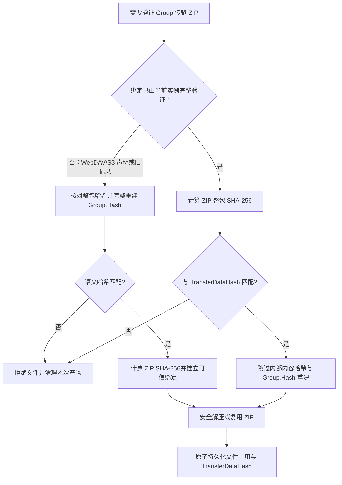

# `TransferDataFile`/`transferDataHash` 与 Group ZIP 快速校验设计

## 文档信息

- 核对分支：`codex/transfer-data-hash`
- 核对提交：`6f0d014c6d565dfc8565a9cf3a4c542e968ae0a1`
- 核对日期：2026-09-01
- 范围：客户端与服务端历史数据库、客户端传输文件路径持久化、历史与普通剪贴板同步 DTO、传输文件生成/接收、Group ZIP 校验
- 实现状态：已在 `codex/transfer-data-hash` 分支完成配套代码、EF Core migration 与测试

## 结论

在客户端 `HistoryRecord` 中新增可空字段 `TransferDataFile` 和 `TransferDataHash`，服务端 `HistoryRecordEntity` 新增可空字段 `TransferDataHash`（服务端已经有 `TransferDataFile`）。`TransferDataHash` 的数据库列名为 `TransferDataHash`，JSON/表单字段名为 `transferDataHash`；它记录“本次实际传输文件的完整字节流”的 SHA-256，统一使用 64 位大写十六进制字符串。

客户端 `TransferDataFile` 持久化本地传输文件路径，只供本机恢复文件引用，不进入历史同步 DTO。工作目录内文件按现有规则保存相对路径，工作目录外的本地源文件可以保留绝对路径。客户端重启后可通过它重新定位 Group ZIP，再使用 `TransferDataHash` 做整包快速校验。

`TransferDataHash` 与现有 `Profile.Hash` 的职责不同：

- `Profile.Hash` 标识剪贴板内容的语义，用于去重和构造 Profile ID；
- `TransferDataHash` 标识一个具体传输文件，用于检查文件是否与先前验证过的传输对象完全一致。

Group 的快速路径不能只检查字段和 ZIP 文件是否非空。必须重新计算当前 ZIP 的 SHA-256，并与可信的 `TransferDataHash` 相等，才能跳过逐条解压、计算文件内容哈希和重建 Group 语义哈希。若当前操作需要解压，ZIP 路径穿越防护和安全解压不能跳过；若只是复用或发送已验证 ZIP，则不应为了校验而打开或枚举 ZIP 内部结构。

首次建立一个 Group 的 `Profile.Hash` 与 `TransferDataHash` 绑定时，仍必须完成现有的内部结构校验。特别是服务端不能信任上传请求中由客户端声明的 `transferDataHash`，否则恶意或有缺陷的客户端可以给任意 ZIP 自行计算 SHA-256，并借此绕过 Group 语义校验。客户端可以信任官方服务器已经验证并持久化的绑定；WebDAV/S3 中的绑定来自其他客户端，仍必须由当前客户端完成首次语义验证。

## 字段语义

### 两类哈希

| Profile 类型 | `Profile.Hash` | `TransferDataHash` |
| --- | --- | --- |
| Text（内联短文本） | UTF-8 文本的 SHA-256 | `null`，因为没有传输文件 |
| Text（长文本文件） | UTF-8 文本内容的 SHA-256 | 传输文本文件完整字节的 SHA-256；按当前无 BOM UTF-8 写入规则应与 `Profile.Hash` 相等 |
| File | `SHA256("文件名\|文件内容SHA256")` | 文件内容字节的 SHA-256，通常不等于 `Profile.Hash` |
| Image | 与 File 相同 | 图片文件字节的 SHA-256，通常不等于 `Profile.Hash` |
| Group | 规范化条目名称、长度和各文件内容哈希汇总得到的语义 SHA-256 | 最终 ZIP 文件完整字节的 SHA-256，通常不等于 `Profile.Hash` |

这里“Text/File/Image 与文件本身的 hash 一致”指 `TransferDataHash` 等于传输文件字节的 SHA-256，不表示 File/Image 的 `Profile.Hash` 要改成文件内容 SHA-256。现有 Profile 哈希算法和 Profile ID 均保持不变。

同一个 Group 内容可以因压缩级别、条目时间戳、ZIP 实现或条目写入细节不同而产生不同的 ZIP 字节，因此也可以有不同的 `TransferDataHash`；它们仍然共享同一个 `Profile.Hash`。`TransferDataHash` 不能参与历史记录去重、工作目录命名或 Profile ID 计算。

### 空值与可信状态

字段使用 `string?`，不使用空字符串表达未知状态：

- `null`：没有传输文件，或旧记录尚未建立可信的传输文件哈希；
- 64 位 SHA-256：表示远端声明或本地计算出的传输文件哈希；字段存在本身不代表它与 `Profile.Hash` 的绑定可信；
- 其他格式：视为无效输入，不得进入快速路径。

只有 Profile 运行时使用非持久化的 `HasVerifiedTransferDataHashBinding` 区分“尚未验证的 DTO 声明值”与“已经建立的绑定”，并在内部记录本次已验证的传输文件路径。该状态不进入 `ProfilePersistentInfo`、History 实体、数据库、`ProfileDto` 或 `HistoryRecordDto`。持久化模型采用更强的不变量：非空 `TransferDataHash` 必须已经由本机验证，或来自可信的官方服务器。由持久化记录重建 Profile 时，非空哈希本身就表示绑定已经建立，不再需要额外的信任字段；本地文件仍会在需要使用或重新持久化时按哈希验证。

## 当前实现与改造原因

当前 `GroupProfile` 有两条昂贵路径：

1. `PrepareTransferData()` 复用既有 ZIP 前，通过 `VerifyExistingTransferArchiveAsync()` 打开归档、逐条读取内容并重建 Group 哈希；
2. `SetTransferData(..., TransferDataValidation.Full(...))` 先解压 ZIP，再通过 `CaclHashAndSize()` 重新读取解压后的全部文件并重建 Group 哈希。

两条路径都只能证明 ZIP 的内容仍对应 `Profile.Hash`，但没有持久化“这一个已经验证过的 ZIP 文件”的标识。进程重启或从数据库重建 Profile 后，无法通过整包哈希识别相同 ZIP，只能重复读取内部文件。

服务端数据库已经保存 `TransferDataFile`，所以新增哈希后可以在进程重启后继续识别同一个 ZIP。客户端当前只保存 Group 解压后或原始的 `FilePath`，会丢失 ZIP 引用；新增客户端 `TransferDataFile` 后，`HistoryRecord -> Profile` 重建必须同时恢复 ZIP 路径和哈希，从而让客户端也能跨进程复用同一个已验证 ZIP。

服务端实体中目前已有 `TransferDataSha256` 和 `TransferDataMd5` 两个非空字符串字段，但生产代码没有读写它们，也没有把它们映射到 Profile、历史 DTO 或客户端数据库。新字段采用明确的统一名称 `TransferDataHash`。本次不删除旧列，避免把性能优化与破坏性数据库清理耦合；也不直接信任或复制旧列值。后续可在独立迁移中清理旧列。

## 数据模型与协议

### 持久化模型

修改以下模型：

- `SyncClipboard.Core.Models.HistoryRecord`：新增 `string? TransferDataFile` 和 `string? TransferDataHash`；
- `SyncClipboard.Server.Core.Models.HistoryRecordEntity`：新增 `string? TransferDataHash`；
- `SyncClipboard.Shared.Profiles.Models.ProfilePersistentInfo`：新增 `string? TransferDataHash`；
- `Profile`：保存当前传输文件哈希，并在内存中记录该绑定是否已经验证；仅由明确区分来源的创建和验证流程更新。

所有 Profile 的持久化、构造和 `CopyTo()` 都要传递该字段。重点映射位置包括：

- 客户端 `HistoryManager.ToHistoryRecord()` 与 `MapperExtensions.ToProfile()`，同时映射 `TransferDataFile` 和 `TransferDataHash`；
- 服务端 `Mapper.ToHistoryEntity()` 与 `Mapper.ToProfile()`；
- 服务端已有记录替换传输文件时的字段复制；
- 客户端新增本地记录、下载完成、上传成功和远端记录合并。

客户端 `TransferDataFile` 的类型语义如下：

| Profile 类型 | 客户端 `TransferDataFile` | `FilePath` |
| --- | --- | --- |
| Text（内联短文本） | `null` | 空数组 |
| Text（长文本文件） | 传输文本文件的持久化路径 | 可以继续保存同一文本文件路径 |
| File/Image | 传输文件的持久化路径 | 可以继续保存同一文件路径 |
| Group | ZIP 的持久化路径，正常为工作目录内相对路径 | 保存原始或解压后的顶层文件/目录路径，不用 ZIP 替换 |

客户端字段不得保存服务端路径、下载 URL 或由远端元数据指定的持久化路径。`Profile.Persist()` 继续通过 `GetPersistentPath()` 处理路径：工作目录内保存相对路径，工作目录外保留本地绝对路径；`Profile.Create()` 继续通过 `GetFullPath()` 在规范的 `{Type}_{Profile.Hash}` 工作目录下恢复相对路径。无论相对还是绝对，字段值只能来自本地 Profile 持久化结果，不能从远程 DTO 写入。

本地 `TransferDataFile` 与 `TransferDataHash` 必须在同一次数据库保存中更新。替换 Group ZIP 或其他本地传输文件时，不得出现新路径配旧哈希。删除或判定本地传输文件不可用时清空 `TransferDataFile`；若记录是 `LocalOnly`，同时清空哈希；若记录有服务端副本，可以保留服务端返回的哈希供后续下载校验。

客户端一条记录可能同时具有本地内容和服务端副本，而相同 Group 的本地 ZIP 与服务端 ZIP 字节不一定相同。采用以下归属规则避免一个字段同时代表两个文件：

- `IsLocalFileReady == true` 时，字段描述客户端当前可用于传输的本地文件；没有已生成/下载的本地传输文件时允许为 `null`；
- `IsLocalFileReady == false` 且记录来自官方服务端时，`TransferDataFile` 为 `null`，`TransferDataHash` 描述服务端待下载文件；WebDAV/S3 的未验证声明不写入历史数据库；
- 开始下载前以最新服务端 DTO 刷新待下载 Profile 的字段；下载成功后，本地文件与服务端文件字节相同，字段含义自然切换为本地文件；
- 同步合并远端元数据时，永远不从 DTO 更新本地 `TransferDataFile`，也不用远端哈希覆盖仍可用的、本地字节不同的传输文件哈希。

### 历史同步 DTO

`HistoryRecordDto` 新增可空属性 `TransferDataHash`，JSON 名自然序列化为 `transferDataHash`。它必须进入以下路径：

- 服务端查询历史和 SignalR 变更通知；
- 客户端远端记录创建与更新；
- 历史上传 multipart 元数据；
- 服务端 multipart 解析和记录响应。

`TransferDataFile` 不加入 `HistoryRecordDto`。客户端路径是本机内部状态；服务端自己的 `TransferDataFile` 也是服务端内部状态。下载文件名继续由现有 HTTP 响应和 Profile 逻辑决定，不能通过历史元数据交换持久化路径。

multipart 中该字段为可选字段。服务端对非空值要求恰好为 64 个十六进制字符，并规范化为大写；格式错误返回 400。旧客户端不发送字段时，服务端仍按完整校验路径处理并自行计算。旧服务端不返回字段时，新客户端将其视为 `null` 并使用旧校验路径。

上传请求中的值只用于传输完整性检查和诊断：服务端计算实际文件 SHA-256 后，如客户端声明了哈希但不匹配，应返回稳定的 422 `history_data_invalid`；即使匹配，新的 Group 记录仍必须完成内部语义校验。服务端最终持久化自己计算出的值，而不是直接持久化请求字符串。

### 普通剪贴板同步 DTO

`ProfileDto` 同样新增可空 `TransferDataHash`，JSON 字段名为 `transferDataHash`。值为 `null` 时序列化省略该字段，因此旧客户端、旧服务端以及已有 WebDAV/S3 `SyncClipboard.json` 均保持兼容。

普通同步的 File/Image/Text/Group 在生成或验证传输文件后，由 `ToProfileDto()` 输出当前哈希。WebDAV/S3 使用通用 `Profile.Create(ProfileDto)`，恢复声明值但不把绑定标记为已验证；官方服务端入口使用显式的可信来源参数。来源判断由适配器完成，不进入 DTO，其他客户端无法通过协议字段伪造“官方可信”状态。

下载调用 `SetTransferData()` 时显式传入 `TransferDataValidation`。WebDAV/S3 使用 `Full(expectedHash)`，同时验证传输文件 SHA-256 和 Profile 语义；官方服务端使用 `PreferTransferDataHash(expectedHash)`，但只有期望传输哈希合法且与实际文件匹配时才允许跳过语义验证。字段缺失或格式无效时一律回退到完整语义验证。

官方服务端接收 `PUT SyncClipboard.json` 时不直接信任该字段：先验证字段格式和暂存文件的整包 SHA-256，再清除 DTO 中的哈希创建 Profile，以保证首次 Group 文件仍执行内部语义校验。验证完成后，服务端通过自己计算出的哈希保存并广播新的 `ProfileDto`。

## 哈希产生与更新

### Text

- 短文本没有传输文件，保持 `TransferDataHash = null`；
- 长文本写入无 BOM UTF-8 文件后，计算文件 SHA-256；
- `PrepareTransferData()` 或带验证模式的 `SetTransferData()` 已读取文件校验文本哈希时，复用同一次计算结果设置字段；
- 文件内容变化时，清空旧值并按现有本地数据不可用流程报错。

### File / Image

将文件校验重构为一次读取同时得到：

1. 文件内容 SHA-256，即 `TransferDataHash`；
2. 文件名与内容哈希组合后的 `Profile.Hash`。

只有组合哈希与记录的 `Profile.Hash` 相等后，才保存内容 SHA-256。同一次文件读取同时生成两个哈希，避免重复扫描大文件。

### Group：新建 ZIP

`CreateTransferArchiveAsync()` 继续在写入每个条目时计算文件内容哈希并核对 Group 语义哈希。ZIP 完全关闭、临时文件校验成功并原子移动为最终文件后，再计算最终 ZIP 文件 SHA-256 并设置 `TransferDataHash`。

不能在 ZIP 关闭前固定哈希，因为中央目录等字节在关闭归档时才写完。若后续 SHA-256 计算、移动或持久化失败，不得提交新哈希；数据库中的文件引用与哈希必须保持上一组一致值或同时为空。

### 接收传输文件

服务端保存上传流时可以用 `IncrementalHash` 在写盘的同一遍复制中计算 SHA-256，避免额外读取整个传输文件。客户端现有下载接口可先下载到目标文件，再流式计算 SHA-256；后续若改造下载流，也可以在下载写盘时同步计算。

任何从网络接收的文件都应先写入临时路径。完成整包哈希和所需语义校验后再原子发布，失败时删除临时文件与本次新建的解压目录。该原子化要求沿用现有拒绝上传清理规则。

## Group ZIP 校验流程

### 快速路径判定

对已有或刚下载的 ZIP 执行以下顺序：

1. 文件必须存在且扩展名符合现有要求；
2. `TransferDataHash` 必须是合法 SHA-256，且该绑定已由当前实例验证、从本地持久化恢复，或来自可信官方服务器；
3. 流式计算当前 ZIP 完整字节的 SHA-256；
4. 只有实际值与字段值大小写无关地相等时，才命中快速路径；
5. 命中后跳过逐条内容哈希和 Group 语义哈希重建。

“ZIP 与 `TransferDataHash` 都存在”在实现中必须解释为“ZIP 存在、字段合法，并且 ZIP 的实际 SHA-256 与字段相等”，不能只检查非空。



### 快速路径不能跳过的检查

即使整包哈希匹配，以下行为仍保留：

- 当前操作需要解压时，由打开 `ZipArchive` 自然完成的可读性检查；
- 当前操作需要解压时的目标路径规范化和 Zip Slip 防护；
- 取消令牌、I/O 异常和权限错误处理；
- 需要把 Group 放入本地剪贴板时的实际解压；
- 临时文件/目录失败清理。

快速路径跳过的是“为证明 ZIP 内容对应 `Profile.Hash` 而进行的逐条内容 SHA-256、长度汇总、排序和 Group 哈希重建”。仅复用或发送 ZIP 时不打开归档；需要解压时仍执行安全解压，但不为语义校验再次读取解压结果。

### 哈希缺失或不匹配

- 哈希为 `null`：按旧逻辑完整验证；成功后计算 ZIP SHA-256，供本次 Profile 使用，并在下一次历史记录保存时回填；
- 哈希格式错误：网络输入直接拒绝，本地旧数据按未知哈希处理并记录警告；
- 哈希与 ZIP 不匹配：视为文件损坏或被替换，不允许通过内部结构碰巧仍有效而静默更新哈希；
- `PrepareTransferData()` 遇到本地缓存 ZIP 哈希不匹配时，可以从仍然有效的 `_files` 重新生成；无法重新生成则抛出 `LocalProfileDataUnavailableException`；
- 网络下载或服务端存储文件不匹配时，拒绝当前文件并走现有错误/重试流程，不把错误值写入数据库。

不匹配时不回退到“内部结构有效就接受”，是为了让 `TransferDataHash` 真正提供端到端的具体文件完整性保证，并避免掩盖存储损坏。

## 信任边界

### 客户端本地生成

File/Image/Text 在核对现有 `Profile.Hash` 后保存文件 SHA-256；Group 在打包过程中核对完整语义哈希后保存 ZIP SHA-256。因此客户端本地生成的值可以用于后续本地快速校验，也可以随上传请求发送。

### 服务端首次上传

服务端按以下顺序处理新 Group：

1. 将请求流写入临时文件，同时计算实际 ZIP SHA-256；
2. 若请求声明了 `transferDataHash`，先与实际值比较，不匹配立即 422；
3. 不论客户端声明值是否匹配，都执行一次完整 Group 内部语义校验，确认 ZIP 对应请求中的 `Profile.Hash`；
4. 成功后持久化服务端计算的实际 SHA-256，并原子发布文件和记录；
5. 后续对同一服务端文件的检查才允许使用整包哈希快速路径。

Text/File/Image 也应由服务端计算实际 SHA-256 并持久化。它们继续执行现有 Profile 校验，不能用请求字段代替文件名、文本或 Profile 哈希校验。

### 客户端下载

所有来源都必须先计算实际文件 SHA-256；若远端提供的哈希不相等，立即拒绝当前文件。之后按来源区分：

- 官方服务器：客户端信任服务器已经建立的 `TransferDataHash` 与 `Profile.Hash` 绑定，整包哈希匹配后可以跳过 Profile 语义验证；Group 仍在需要落地时执行安全解压和 Zip Slip 防护；
- WebDAV/S3：绑定由其他客户端写入，不可信。File/Image/Text 继续验证 Profile 语义，Group 安全解压并重建 Group 语义哈希；
- 服务端未返回传输哈希：不能跳过语义验证，成功后由本机计算并建立绑定；
- 验证成功或从可信官方服务器取得后，路径和两类哈希一起持久化；数据库不保存额外信任状态，非空字段本身必须满足已验证绑定不变量；
- 后续从数据库恢复时，只需重新计算本地传输文件 SHA-256 并与持久化值比较，匹配即可走快速路径。

## 数据库迁移与兼容

客户端和服务端分别新增一条 EF Core migration。客户端 migration 增加路径和哈希两列：

```sql
ALTER TABLE HistoryRecords ADD COLUMN TransferDataFile TEXT NULL;
ALTER TABLE HistoryRecords ADD COLUMN TransferDataHash TEXT NULL;
```

服务端已经有 `TransferDataFile`，只增加哈希列：

```sql
ALTER TABLE HistoryRecords ADD COLUMN TransferDataHash TEXT NULL;
```

迁移设计要求：

1. 列可空、无默认空字符串、无需索引；
2. 不在 migration 中扫描历史文件或 ZIP，避免启动迁移变成大规模 I/O；
3. 现有客户端记录的两个新字段保持 `null`；下次 Profile 持久化时写入路径，文件下一次成功完整验证时写入哈希；
4. 服务端现有 `TransferDataSha256`/`TransferDataMd5` 保留原状，不自动复制到新列；生产代码从未为其建立可信写入不变量；
5. `Down()` 只删除新列，不修改旧列；
6. 客户端继续通过 `HistoryManager.InitDatabaseContext()` 应用 migration，服务端继续通过 `MigrationHelper` 应用 migration。

新旧版本兼容策略：

| 组合 | 行为 |
| --- | --- |
| 新客户端 + 新官方服务端 | 整包哈希匹配后可直接使用服务端已验证绑定；WebDAV/S3 仍首次完整验证 |
| 旧客户端 + 新服务端 | 字段缺失；服务端完整验证并自行生成 |
| 新客户端 + 旧服务端 | DTO 中字段缺失；客户端使用旧的完整校验路径 |
| 迁移前历史记录 | 字段为 `null`；首次完整验证成功后惰性回填 |

## 关键代码改造点

### Shared

- `ProfileDto.cs`：增加可选 `TransferDataHash`，空值不写入 JSON；
- `Profiles/Models/ProfilePersistentInfo.cs`：增加字段；
- `Profiles/Profile.cs`：保存/暴露当前传输文件哈希，提供格式规范化公共逻辑；
- `Profiles/TextProfile.cs`：生成、验证、持久化和复制传输文件哈希；
- `Profiles/FileProfile.cs`：一次读取生成内容哈希与组合 Profile 哈希；Image 自动继承；
- `Profiles/GroupProfile.cs`：
  - 新 ZIP 关闭后计算 ZIP SHA-256；
  - 将 `ExtractAndVerifyTransferData()` 拆成安全解压与可选语义验证；
  - `PrepareTransferData()` 和 `SetTransferData()` 增加整包哈希快速路径；
  - 旧记录完整验证成功后学习哈希；
  - `CopyTo()` 复制字段。

### Client Core

- `Models/HistoryRecord.cs`：增加 `TransferDataFile` 和 `TransferDataHash` 持久化属性；
- `Models/MapperExtensions.cs`：DTO、HistoryRecord、Profile 三方映射；
- `Utilities/History/HistoryManager.cs`：新增/更新记录时保存 `ProfilePersistentInfo.TransferDataFile` 和哈希；按本地可用状态合并远端字段；
- `Utilities/History/HistoryTransferQueue.cs`：
  - 上传在 `PrepareTransferData()` 后重新取得 Profile 持久化信息，将本地传输路径与哈希写入记录，并把哈希写入 DTO；
  - 上传成功后持久化服务端确认的值；
  - 下载前使用最新服务端哈希，成功后把下载文件路径与哈希随本地记录持久化；
- `RemoteServer/Adapter/OfficialServer/OfficialAdapter.cs`：multipart 可选字段。

### Server Core

- `Models/HistoryRecordEntity.cs` 与 `HistoryRecordDto.cs`：增加字段及双向映射；
- `Models/Mapper.cs`：Profile 持久化信息与实体之间传递字段；
- `Controllers/HistoryController.cs`：解析并校验可选表单字段；
- `Controllers/SyncClipboardController.cs`：校验普通同步 DTO 的可选字段和暂存传输文件，首次 Group 接收仍执行完整语义校验；
- `Services/History/HistoryService.cs`：上传写盘时计算实际 SHA-256；首次 Group 上传完成语义校验后才保存；更新传输文件时同步更新字段；响应 DTO 返回字段。

## 并发与原子性

`TransferDataHash` 描述具体文件，因此更新顺序不能暴露“新文件 + 旧哈希”或“旧文件 + 新哈希”：

1. 文件写入唯一临时路径；
2. 计算 SHA-256 并完成所需语义校验；
3. 关闭所有文件和 ZIP 流；
4. 原子移动文件到最终路径；
5. 在同一次 `SaveChangesAsync()` 中保存 `TransferDataFile` 和 `TransferDataHash`；
6. DB 保存失败时清理本次新文件，或保留可由孤儿清理处理的未引用文件，但不能修改内存中的已提交状态。

Group 的 `_transferDataLock` 继续保护同一 Profile 实例的准备过程。哈希计算与文件使用之间仍存在文件被外部替换的理论竞态；上传适配器应尽快以只读共享策略打开已验证文件。服务端和下载端以临时文件接收并原子发布，避免其他线程看到半成品。

## 测试计划

### 单元测试

1. Text 长文本：`TransferDataHash == Profile.Hash`；短文本为 `null`。
2. File/Image：字段等于文件内容 SHA-256，且在一般文件名下不等于组合后的 `Profile.Hash`。
3. File/Image 内容变化：准备失败，不保留旧 `TransferDataHash`。
4. Group 新建 ZIP：先通过语义校验，再得到等于 ZIP 文件 SHA-256 的字段。
5. Group 旧记录哈希为空：完整校验成功后学习字段；无效 ZIP 仍被拒绝。
6. Group 已知哈希匹配：复用 ZIP 或安全解压时不再调用条目内容哈希/Group 哈希重建逻辑。
7. Group 已知哈希不匹配：不进入内部校验兜底；有有效源文件时重新生成，否则报本地数据不可用。
8. Group ZIP 匹配时仍拒绝 Zip Slip 路径；快速路径不能关闭路径安全检查。
9. `ProfilePersistentInfo` 和 `CopyTo()` 往返不丢字段。

为可靠证明“没有读取 ZIP 内部内容”，建议把整包校验和语义校验拆成可独立观测的内部方法，并通过测试替身或调用计数验证分支；不要只用耗时断言。

### 客户端历史测试

1. migration 能从现有客户端数据库升级，旧记录的 `TransferDataFile` 和 `TransferDataHash` 均为 `null`；
2. 本地新增、已有记录更新、下载完成、上传成功后路径与哈希正确持久化；
3. 远端记录在本地无数据时保存服务端字段；本地已有不同 ZIP 时不被远端值错误覆盖；
4. `HistoryRecord -> Profile -> HistoryRecord` 往返保持路径与哈希，客户端重启后 Group 能恢复 ZIP；
5. 软删除、本地文件丢失和重新下载时遵守清空/保留规则。

### 服务端与协议测试

1. migration 能从现有服务端数据库升级，不修改旧哈希列；
2. 旧客户端不发送字段时上传成功，服务端自行生成并在响应中返回；
3. 声明值与上传字节不匹配时返回 422，不创建记录、不残留文件；
4. 恶意客户端为错误 Group ZIP 提供“正确的 ZIP SHA-256”时，首次上传仍因 Group 语义哈希不匹配而返回 422；
5. 有效 Group 首次上传完整验证，后续相同服务端文件使用快速路径；
6. 查询接口和 SignalR 通知正确序列化 `transferDataHash`；
7. 替换记录传输文件时，文件引用与哈希同步更新。
8. 不含 `transferDataHash` 的旧版 `ProfileDto` 可正常反序列化，空值序列化时省略字段。
9. 普通同步 `ProfileDto` 在 Text/File/Image/Group 构造与输出间保持哈希。
10. 普通同步首次 Group 上传不能利用自声明 ZIP 哈希绕过语义校验。

### 回归与性能验证

- 运行 `SyncClipboard.Test` 中现有 `ProfileTransferValidationTests` 和 `GroupProfileTransferTests`，旧的损坏/空 ZIP 行为不得放宽；
- 运行客户端历史同步、服务端历史上传和 DI 验证测试；
- 构造包含大量文件的 Group，对比首次完整校验与后续快速校验：后续应只顺序读取 ZIP 字节一次，不再解压并逐文件计算 SHA-256；
- 验证取消、磁盘满、权限错误、DB 保存失败时没有错误哈希或半成品被提交。

## 验收标准

- [x] 客户端历史数据库有可空 `TransferDataFile` 和 `TransferDataHash` 列，服务端有可空 `TransferDataHash` 列，并能从现有数据库无损升级。
- [x] 客户端 `TransferDataFile` 只保存本地持久化路径，不进入 DTO；Group 可在客户端重启后恢复 ZIP 引用。
- [x] 历史 DTO 与普通剪贴板 `ProfileDto` 均以可选字段传递 `TransferDataHash`，字段缺失时保持向后兼容。
- [x] 字段统一表示传输文件完整字节的 SHA-256，不改变任何 Profile 哈希算法。
- [x] Text/File/Image 在已有文件校验读取中生成字段；Group 保存最终 ZIP 的 SHA-256。
- [x] 新旧客户端/服务端组合可以正常工作；字段缺失只影响性能，不影响正确性。
- [x] 服务端不信任客户端声明值，首次 Group 上传仍完整验证内部语义。
- [x] 客户端信任官方服务器已验证的哈希绑定；WebDAV/S3 的 DTO 声明仍在本地首次完整验证。
- [x] ZIP 实际 SHA-256 与可信字段相等时，不再逐条计算内部文件哈希或重建 Group 哈希。
- [x] 哈希不匹配时拒绝或从有效源数据重建，不静默接受并改写字段。
- [x] 快速路径仍执行安全解压和 Zip Slip 防护。
- [x] 客户端 `TransferDataFile` 与 `TransferDataHash` 原子更新，失败不会留下已提交的错误绑定。
- [x] 现有空 ZIP、内容变更、缺失文件和服务端 422 回归测试继续通过。

## 非目标

- 不改变 `Profile.Hash`、Profile ID、历史去重键或工作目录结构；
- 不保证相同 Group 内容生成字节完全一致的 ZIP；
- 不用 `TransferDataHash` 替代 TLS、认证、Zip Slip 防护或首次 Group 语义校验；
- 不在本次改动中删除服务端旧的 `TransferDataSha256`/`TransferDataMd5` 列；
- 不改变普通剪贴板同步现有的文件上传端点、对象键或 Profile ID。
